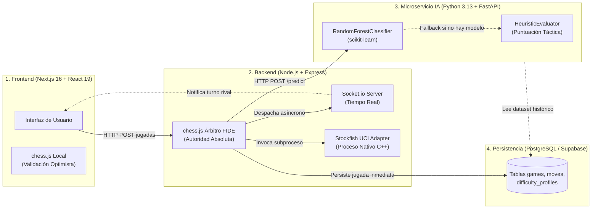
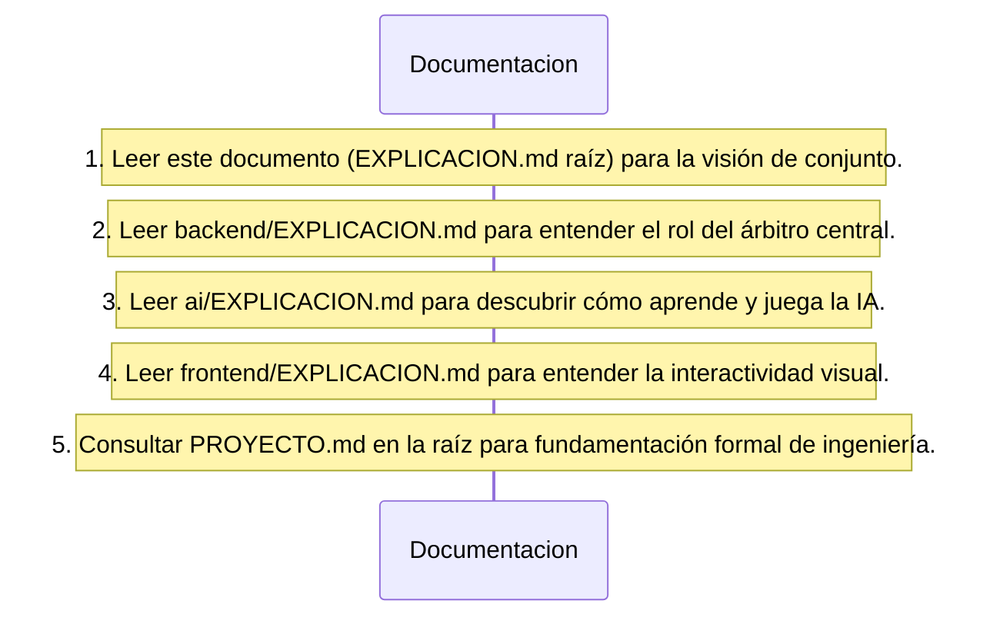
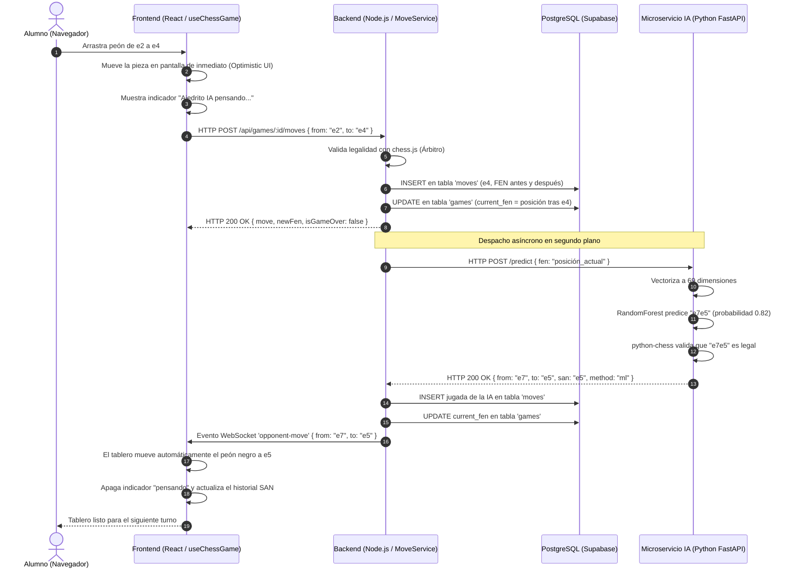

# EXPLICACION.md — Guía Maestra de Comprensión del Sistema Ajedrito

Bienvenido a la documentación explicativa central de **Ajedrito**, una plataforma educativa integral de ajedrez diseñada para brindar una experiencia de juego interactiva, accesible, didáctica y técnicamente rigurosa.

Esta guía está redactada con una visión pedagógica orientada a desarrolladores de todos los niveles: desde quienes dan sus primeros pasos en arquitecturas web y Machine Learning hasta ingenieros de software consolidados que deseen comprender rápidamente la estructura global del repositorio.

---

## 1. ¿Qué es Ajedrito y qué problema resuelve?

Aprender ajedrez en la era digital suele presentar dos barreras críticas:
1. **Barrera de Accesibilidad (Fricción de Entrada):** La mayoría de las plataformas comerciales exigen registros tediosos, cuentas de correo y contraseñas. Para una escuela o una clase universitaria, esto genera fricción y desmotiva a los estudiantes.
2. **Barrera Pedagógica de los Motores Tradicionales:** Los motores analíticos de ajedrez (como Stockfish) calculan millones de jugadas por segundo mediante árboles de búsqueda casi perfectos. Jugar contra ellos resulta a menudo implacable y frustrante para un principiante, ya que la máquina castiga cualquier imprecisión sin criterio formativo.

**Ajedrito** resuelve ambos desafíos integrando tres componentes en armonía:
* **Acceso Inmediato:** Permite entrar y jugar al instante en cualquier dispositivo sin requerir registro previo, persistiendo las partidas en el navegador del usuario.
* **Inteligencia Artificial Propia y Adaptativa:** Incorpora un modelo de Machine Learning entrenado con partidas de personas reales que juega con naturalidad humana y modera su agresividad si el alumno está perdiendo piezas.
* **Motor Profesional Calibrado:** Para usuarios avanzados o clases tácticas, integra también **Stockfish** con niveles de dificultad graduados por Elo (Principiante ~800, Intermedio ~1500, Avanzado ~2200, Experto ~3190).
* **Identidad Institucional:** Proyecto apadrinado en el marco educativo de la **Universidad Nacional de Villa Mercedes (UNVIME)**.

---

## 2. Mapa Global del Repositorio

El repositorio está organizado bajo un enfoque modular de **tres capas independientes**, cada una en su propio subdirectorio con sus propias tecnologías y dependencias:

```text
Ajedrito/
│
├── frontend/                  # [Capa 1: Presentación e Interacción]
│   ├── src/app/               # Enrutamiento de Next.js 16 (App Router)
│   ├── src/components/        # Componentes UI (tablero, controles, modales)
│   ├── src/hooks/             # Custom Hooks (useChessGame, useGameSetup)
│   ├── src/lib/               # Cliente HTTP (api.ts) y memoria local (gameStorage.ts)
│   ├── EXPLICACION.md         # Guía didáctica específica del Frontend
│   └── PROYECTO.md            # Memoria técnica formal del Frontend
│
├── backend/                   # [Capa 2: Arbitraje, Persistencia y Orquestación]
│   ├── bin/                   # Ejecutable nativo del motor Stockfish
│   ├── src/routes/            # Endpoints HTTP REST (Express)
│   ├── src/services/          # Lógica central: MoveService, GameStateEvaluator
│   ├── src/strategies/        # Estrategias de rivales: Stockfish, IA Propia, Humano
│   ├── src/adapters/          # Adaptadores: Pipes UCI para Stockfish, HTTP para IA
│   ├── src/repositories/      # Aislamiento de base de datos (PostgreSQL/Sequelize)
│   ├── EXPLICACION.md         # Guía didáctica específica del Backend
│   └── PROYECTO.md            # Memoria técnica formal del Backend
│
├── ai/                        # [Capa 3: Inteligencia Artificial y Machine Learning]
│   ├── models/                # Artefacto entrenado serializado (chess_model.joblib)
│   ├── src/api/               # Endpoints REST en FastAPI (/predict, /train)
│   ├── src/ml/                # Feature extractor 69D, heurísticas, dificultad y RandomForest
│   ├── src/data/              # ETL de dataset y script de seeding desde Lichess
│   ├── EXPLICACION.md         # Guía didáctica específica del Microservicio de IA
│   └── PROYECTO.md            # Memoria técnica formal del Microservicio de IA
│
├── iniciar-ia.bat             # Script de conveniencia para encender la IA en Windows
├── sembrar-lichess.bat        # Script para descargar partidas de Lichess y reentrenar
├── EXPLICACION.md             # ESTE DOCUMENTO: Guía maestra del sistema completo
└── PROYECTO.md                # Memoria de ingeniería de software definitiva de Ajedrito
```

---

## 3. Los Tres Pilares Tecnológicos

Ajedrito aplica el principio de **"la herramienta correcta para cada problema"**:



1. **Frontend (Next.js 16 / React 19 / Tailwind CSS v4 / TypeScript):**
   * *Misión:* Renderizar la interfaz visual, gestionar el arrastre de piezas (`react-chessboard`), ofrecer retroalimentación táctil instantánea mediante actualización optimista y escuchar eventos en tiempo real.
2. **Backend (Node.js / Express / Socket.io / Sequelize ORM):**
   * *Misión:* Árbitro legal imparcial de las reglas de la FIDE. Persiste cada jugada en PostgreSQL en el milisegundo en que ocurre, coordina los turnos de los motores y notifica a los clientes mediante WebSockets.
3. **Microservicio de IA (Python 3.13 / FastAPI / scikit-learn / python-chess):**
   * *Misión:* Convertir tableros FEN en vectores matemáticos de 69 dimensiones, clasificar jugadas con un bosque de árboles de decisión (`RandomForestClassifier`) y aplicar una política de dificultad adaptativa pedagógica (`DifficultyPolicy`).

---

## 4. ¿Por dónde empezar a leer el proyecto?

Para adquirir una comprensión sólida y progresiva de la arquitectura sin frustrarse, te sugerimos este itinerario de lectura:



1. **Paso 1 — El Árbitro Central ([`backend/src/index.js`](file:///c:/Users/teixi/Workspace/ProyectosEducativos/Ajedrito/backend/src/index.js) y [`backend/src/services/MoveService.js`](file:///c:/Users/teixi/Workspace/ProyectosEducativos/Ajedrito/backend/src/services/MoveService.js)):**  
   Comprende cómo el servidor recibe las jugadas, cómo valida las reglas de ajedrez con `chess.js` y cómo despacha el cálculo de los oponentes de forma asíncrona sin congelar al cliente.
2. **Paso 2 — El Cerebro de la IA ([`ai/src/ml/predictor.py`](file:///c:/Users/teixi/Workspace/ProyectosEducativos/Ajedrito/ai/src/ml/predictor.py) y [`ai/src/ml/feature_extractor.py`](file:///c:/Users/teixi/Workspace/ProyectosEducativos/Ajedrito/ai/src/ml/feature_extractor.py)):**  
   Descubre cómo se transforma una cadena de texto FEN en un vector numérico de 69 características y cómo el modelo predice la jugada asegurando un 100% de legalidad.
3. **Paso 3 — La Experiencia de Usuario ([`frontend/src/app/page.tsx`](file:///c:/Users/teixi/Workspace/ProyectosEducativos/Ajedrito/frontend/src/app/page.tsx) y [`frontend/src/hooks/useChessGame.ts`](file:///c:/Users/teixi/Workspace/ProyectosEducativos/Ajedrito/frontend/src/hooks/useChessGame.ts)):**  
   Analiza cómo la interfaz de usuario mueve las piezas en pantalla de manera optimista antes de confirmar con el servidor y cómo se conecta a Socket.io para esperar la respuesta de la máquina.

---

## 5. El Viaje de una Jugada de Inicio a Fin (Flujo End-to-End)

Para entender cómo dialogan los tres programas al mismo tiempo, sigamos el recorrido completo de una jugada en una partida contra la **IA propia**:



### ¿Por qué este diseño es sobresaliente?
* **El usuario nunca se congela:** El alumno ve su jugada reflejada en menos de 16 milisegundos en pantalla.
* **El servidor no se sobrecarga:** El backend responde la petición HTTP del usuario de inmediato; la máquina calcula en segundo plano y avisa por WebSockets solo cuando termina.
* **Separación de responsabilidades de cómputo:** El backend de Node.js atiende miles de conexiones web livianas (I/O intensivo), mientras que el microservicio en Python utiliza núcleos de CPU dedicados a la inferencia matemática (CPU intensivo).

---

## 6. Conceptos Técnicos Fundamentales Explicados

* **FEN (Forsyth-Edwards Notation):** Es la "foto instantánea" de una partida en una sola línea de texto. Guarda dónde está cada pieza, de quién es el turno y si se puede enrocar. Permite que cualquier módulo pueda entender el estado del juego sin necesidad de conocer todas las jugadas anteriores.
* **SAN (Standard Algebraic Notation):** La notación clásica humana (ej: `"e4"`, `"Nf3"`, `"O-O"`). Es la que se muestra en el historial visual para que los alumnos aprendan a leer partidas.
* **UCI (Universal Chess Interface):** Notación técnica simplificada basada en coordenadas de casillas (ej: `"e2e4"`, `"g1f3"`). Es el idioma que entienden Stockfish y los modelos de Machine Learning.
* **Optimistic UI:** Técnica donde la interfaz asume que la acción tendrá éxito y la dibuja al instante; si ocurre un error inesperado, hace un "deshacer" silencioso (rollback).
* **Random Forest (Bosque Aleatorio):** Algoritmo de Machine Learning que combina cientos de "árboles de decisión" que votan entre sí. Es robusto, no se sobreajusta fácilmente y responde en menos de 4 milisegundos sin requerir tarjetas gráficas costosas.

---

## 7. Guía Rápida para Levantar el Proyecto en tu Computadora

### Requisitos Previos
* **Node.js** (versión 20 o superior).
* **Python** (versión 3.11 o superior; probado en Python 3.13).
* Conexión a internet para comunicarse con la base de datos PostgreSQL en Supabase.

### Puesta en Marcha (3 Terminales)

#### Terminal 1 — Microservicio de IA:
```bash
# Opción A: Mediante el script directo de conveniencia
iniciar-ia.bat

# Opción B: Manual
cd ai
.\.venv\Scripts\activate
uvicorn src.main:app --reload --port 8000
```
*Servicio disponible en:* `http://localhost:8000` (documentación Swagger en `/docs`).

#### Terminal 2 — Backend:
```bash
cd backend
npm run dev
```
*Servidor disponible en:* `http://localhost:3001`.

#### Terminal 3 — Frontend:
```bash
cd frontend
npm run dev
```
*Aplicación web disponible en:* `http://localhost:3000`.

---

## 8. ¿Cómo profundizar técnicamente?

Para profundizar en la arquitectura formal, contratos de interfaces, esquemas de bases de datos, fórmulas matemáticas de vectorización y justificaciones de diseño, te invitamos a consultar el documento técnico maestro:

👉 **[`PROYECTO.md`](file:///c:/Users/teixi/Workspace/ProyectosEducativos/Ajedrito/PROYECTO.md)** en la raíz del repositorio.
