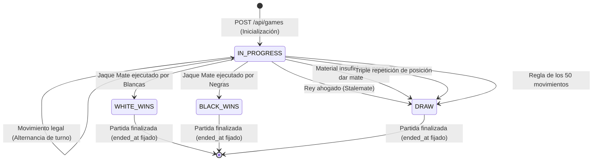
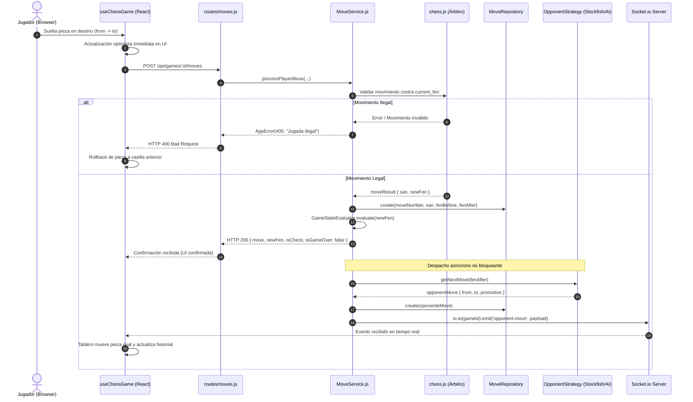
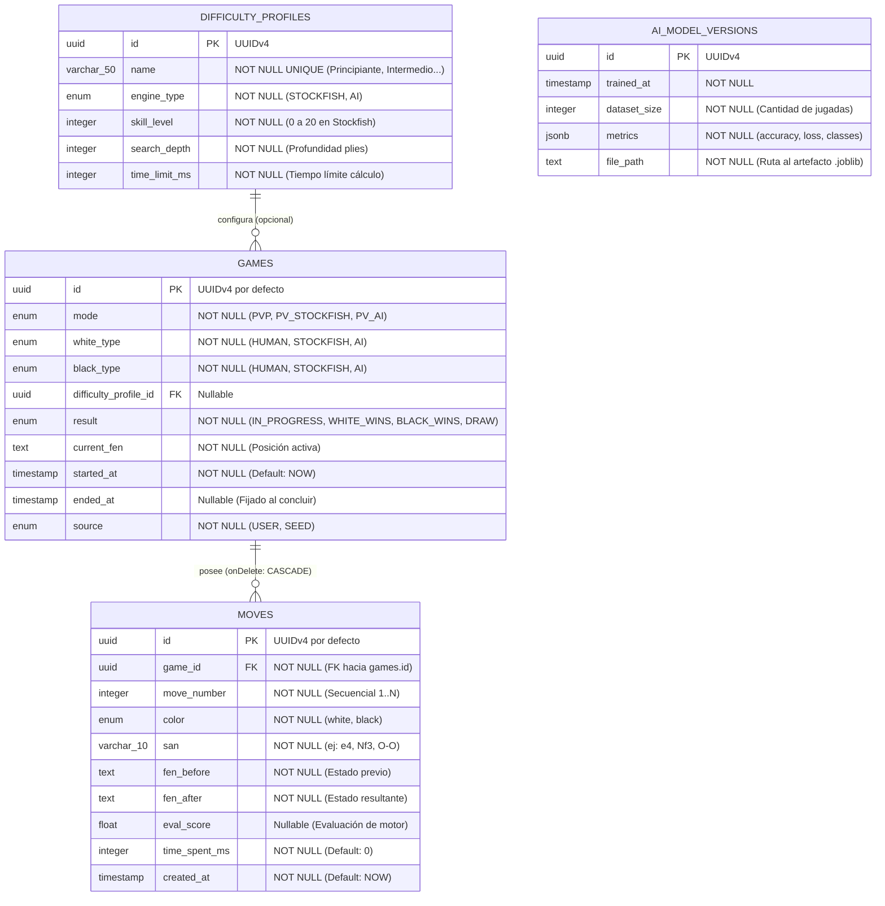

# PROYECTO.md — Memoria Técnica y Documento de Ingeniería del Sistema Ajedrito

Este documento constituye la **memoria formal de arquitectura, ingeniería de software y diseño de sistemas** de **Ajedrito**, una plataforma integral de ajedrez educativo, arbitraje digital en tiempo real y aprendizaje automático adaptativo desarrollada bajo el patrocinio institucional de la **Universidad Nacional de Villa Mercedes (UNVIME)**.

El objetivo de este documento es fundamentar de manera rigurosa, exhaustiva y profesional cada una de las decisiones técnicas, patrones de diseño, contratos de comunicación y estructuras de datos implementadas en el código fuente, ofreciendo una visión holística de todo el ecosistema.

---

## 1. Análisis y Requisitos del Sistema

### 1.1. Propósito y Misión del Proyecto
El proyecto **Ajedrito** tiene como misión democratizar el aprendizaje y la práctica del ajedrez en ámbitos escolares, universitarios y recreativos. La solución está concebida para responder a la pregunta fundamental:

> **"¿Qué debe hacer el sistema?"**  
> El sistema debe proveer una plataforma accesible sin barreras de entrada (cero fricción de autenticación), que arbitre con autoridad absoluta las reglas oficiales de la FIDE, registre cada movimiento para fines pedagógicos y analíticos, y ofrezca rivales sintéticos calibrados: tanto un motor tradicional de alta precisión (**Stockfish**) como un modelo propio de Machine Learning que adapte dinámicamente su agresividad táctica según el desempeño del usuario.

### 1.2. Actores del Sistema
1. **Jugador / Estudiante:** Usuario final que interactúa con la interfaz gráfica web desde cualquier dispositivo (computadora, tablet o smartphone).
2. **Backend (Orquestador y Árbitro):** Nodo de autoridad que valida reglas, gobierna la máquina de estados de las partidas, persiste las jugadas y emite eventos en tiempo real.
3. **Motor Stockfish (Subproceso Nativo):** Motor analítico de referencia mundial ejecutado como proceso hijo bajo el protocolo UCI.
4. **Microservicio de IA (Ajedrito AI):** Servicio de inferencia probabilística y reentrenamiento continuo basado en Machine Learning supervisado.
5. **Administrador / Desarrollador:** Operador que realiza tareas de mantenimiento, monitoreo, reentrenamiento del modelo y despliegues.

### 1.3. Matriz de Requisitos Funcionales (RF)

| ID | Requisito Funcional | Descripción de Ingeniería | Criterio de Aceptación |
| :--- | :--- | :--- | :--- |
| **RF-01** | Creación y Configuración de Partidas | El sistema debe permitir instanciar partidas en tres modos: `PVP` (dos humanos en el mismo dispositivo), `PV_STOCKFISH` (humano vs Stockfish) y `PV_AI` (humano vs IA propia), admitiendo selección de color de piezas (`white` o `black`). | Se crea un registro persistido en la tabla `games` con UUIDv4, estado `IN_PROGRESS` y FEN inicial oficial. |
| **RF-02** | Arbitraje Estricto FIDE | Cada movimiento debe ser evaluado contra la posición FEN activa utilizando un motor de reglas formal (`chess.js`). | Si una jugada viola las leyes de la FIDE, se rechaza con código HTTP 400 (`AppError`) y el tablero no altera su estado. |
| **RF-03** | Persistencia Inmediata y Granular | Cada movimiento individual debe registrarse en base de datos en el instante exacto en que ocurre, no al finalizar la sesión. | La tabla `moves` almacena `game_id`, `move_number`, `color`, `san`, `fen_before`, `fen_after` y `time_spent_ms`. |
| **RF-04** | Detección Automática de Fin de Partida | El sistema debe evaluar de forma determinista la terminación de una partida tras cada jugada. | Reconoce Jaque Mate (`WHITE_WINS` / `BLACK_WINS`), o Tablas (`DRAW`) por rey ahogado, material insuficiente, triple repetición o regla de los 50 movimientos, actualizando `ended_at`. |
| **RF-05** | Bando Inicial y Apertura Autónoma | Si el usuario elige jugar con piezas negras frente a la máquina (Stockfish o IA), la máquina debe ejecutar el primer movimiento de blancas automáticamente. | El endpoint `POST /api/games` calcula y persiste la primera jugada de forma síncrona, retornando al cliente el FEN ya actualizado. |
| **RF-06** | Cálculo y Notificación Asíncrona | La respuesta de los motores sintéticos no debe bloquear la petición HTTP del usuario. | La jugada humana responde de inmediato (< 100 ms); el backend calcula en segundo plano y notifica la respuesta del oponente vía WebSockets (`opponent-move`). |
| **RF-07** | Dificultad Dinámica Adaptativa | La IA propia debe modular su nivel táctico según el balance de material en el tablero. | Si el usuario pierde material significativo ($\ge 4$ peones de desventaja), la IA adopta una política benevolente para no frustrar al estudiante. |
| **RF-08** | Interacción de Coronación de Peón | El frontend debe interceptar el avance de un peón a la fila límite y permitir la elección de pieza (Dama, Torre, Alfil, Caballo). | El movimiento se suspende visualmente hasta que el usuario selecciona la pieza en el modal emergente. |
| **RF-09** | Reanudación sin Autenticación | Las partidas no concluidas iniciadas en un dispositivo deben poder retomarse sin login previo. | Los identificadores de partidas se registran en `localStorage` del navegador y se listan en el banner de partidas guardadas. |
| **RF-10** | Ingesta y Reentrenamiento de IA | El microservicio de IA debe proveer mecanismos para poblar partidas reales de Lichess y reentrenar el modelo supervisado en caliente. | El script `seed_lichess_dataset.py` inserta partidas `SEED` y el endpoint `POST /train` reajusta el modelo y actualiza la memoria RAM. |

### 1.4. Matriz de Requisitos No Funcionales (RNF)

| ID | Requisito No Funcional | Meta Métrica de Ingeniería | Justificación de Diseño |
| :--- | :--- | :--- | :--- |
| **RNF-01** | Latencia de Interacción en Cliente | $< 16\text{ ms}$ (60 FPS) durante el arrastre de piezas. | Optimistic UI updates en React antes de esperar confirmación del servidor. |
| **RNF-02** | Latencia de Respuesta HTTP | $< 100\text{ ms}$ para `POST /api/games/:id/moves`. | Desacoplamiento asíncrono: el cálculo del motor se traslada fuera del ciclo HTTP. |
| **RNF-03** | Latencia de Inferencia ML | $< 30\text{ ms}$ por jugada en CPU estándar sin GPU. | Vectorización compacta de 69 dimensiones y ensamble `RandomForest` optimizado. |
| **RNF-04** | Integridad y Autoridad de Datos | 100% de consistencia referencial ACID en PostgreSQL. | Claves foráneas con borrado en cascada e inmutabilidad histórica de jugadas. |
| **RNF-05** | Resiliencia y Aislamiento de Fallos | MTBF alto; fallas del microservicio no derriban el backend. | Timeouts con `AbortController` y temporizadores de gracia con `child.kill()`. |
| **RNF-06** | Portabilidad y Diseño Responsivo | Soporte nativo desde 360 px hasta pantallas de escritorio 4K. | Layout matemático en CSS `w-[min(480px,calc(100vw-3.5rem),55vh)] aspect-square`. |

### 1.5. Casos de Uso Principales (Diagrama de Casos de Uso)

```mermaid
flowchart TD
    actor User as "Estudiante / Jugador"
    
    subgraph SistemaAjedrito ["Ecosistema Ajedrito"]
        UC1["CU-01: Configurar Modalidad y Bando"]
        UC2["CU-02: Realizar Jugada con Arrastre"]
        UC3["CU-03: Coronar Peón en Modal"]
        UC4["CU-04: Reanudar Partida Guardada"]
        UC5["CU-05: Solicitar Revancha"]
        UC6["CU-06: Arbitrar Jugada y Persistir (Sistema)"]
        UC7["CU-07: Despachar Cálculo a Stockfish / IA (Sistema)"]
        UC8["CU-08: Reentrenar Modelo de Machine Learning (Admin)"]
    end
    
    User --> UC1
    User --> UC2
    User --> UC3
    User --> UC4
    User --> UC5
    UC2 -.->|Dispara| UC6
    UC6 -.->|Si máquina activa| UC7
    UC8 -.->|Ingesta y ajuste| UC7
```

---

## 2. Arquitectura del Sistema

Esta sección responde a la pregunta de ingeniería:

> **"¿Cómo estará organizado el sistema?"**  
> El sistema implementa una **Arquitectura Distribuida en Tres Capas (Three-Tier Distributed Architecture)** con desacoplamiento de responsabilidades basado en la naturaleza de cada carga de cómputo: capa de presentación interactiva (Next.js), capa de arbitraje e I/O intensivo (Node.js/Express/WebSockets) y capa de procesamiento analítico y CPU-bound (Python/FastAPI/scikit-learn), respaldadas por una base de datos relacional transaccional (PostgreSQL).

### 2.1. Diagrama de Contenedores y Flujos de Comunicación

```mermaid
flowchart TB
    subgraph TierCliente ["Tier 1: Cliente / Presentación (Puerto 3000)"]
        Browser["Navegador Web (Desktop / Tablet / Mobile)"]
        NextApp["Next.js 16 App Router (React 19)\n- react-chessboard + chess.js local\n- Custom Hooks (useChessGame, useGameSetup)\n- LocalStorage ('ajedrito_local_games')"]
        Browser <--> NextApp
    end

    subgraph TierOrquestacion ["Tier 2: Orquestación, Arbitraje e I/O (Puerto 3001)"]
        ExpressServer["Express.js Server\n- HTTP REST Routers (/api/games, /moves, /profiles)\n- Middleware Centralizado (AppError / errorHandler)\n- Sequelize ORM (Pool de conexiones SSL)"]
        SocketIOServer["Socket.io Server\n- Salas WebSocket por gameId\n- Notificación de turno 'opponent-move'"]
        MoveService["MoveService & GameStateEvaluator\n- Validación legal FIDE\n- Persistencia continua de estados"]
        StockfishProc["Subproceso Nativo Stockfish\n- spawn(bin/stockfish.exe)\n- Protocolo UCI por stdin/stdout"]
        
        ExpressServer --- SocketIOServer
        ExpressServer --> MoveService
        MoveService --> StockfishProc
    end

    subgraph TierIA ["Tier 3: Inteligencia Artificial y Machine Learning (Puerto 8000)"]
        FastAPIServer["FastAPI Application\n- Starlette Threadpool Dispatcher\n- ModelRegistry (Caché Singleton en RAM)\n- Feature Extractor (Vector de 69D)\n- Evaluador Heurístico Táctico\n- RandomForestClassifier"]
    end

    subgraph TierPersistencia ["Tier 4: Almacenamiento Relacional (Puerto 5432 / 6543)"]
        PostgresDB[(PostgreSQL en Supabase)\n- Tabla games\n- Tabla moves\n- Tabla difficulty_profiles\n- Tabla ai_model_versions]
    end

    NextApp -->|1. HTTP POST: Crear / Mover| ExpressServer
    SocketIOServer -.->|2. WebSocket: opponent-move| NextApp
    MoveService -->|3. Pipes stdin/stdout UCI| StockfishProc
    MoveService -->|4. HTTP POST /predict| FastAPIServer
    ExpressServer -->|5. SQL CRUD / SSL Pooling| PostgresDB
    FastAPIServer -.->|6. SQL Ingesta / Reentrenamiento| PostgresDB
```

### 2.2. Justificación de la Separación de Tiers
1. **Node.js para I/O Intensivo vs Python para Cómputo Analítico:** Node.js sobresale en el manejo no bloqueante de miles de sockets concurrentes, peticiones HTTP rápidas y streaming de tuberías de sistema operativo. Sin embargo, ejecutar algoritmos de Machine Learning intensivos en CPU en el mismo hilo de Node.js bloquearía la atención de peticiones web. Al delegar la inferencia en un microservicio de Python (FastAPI), la carga analítica se aísla por completo.
2. **Desacoplamiento de Despliegue:** Cada uno de los tres componentes puede escalarse de manera independiente (por ejemplo, escalar réplicas del frontend en Vercel, el backend en contenedores Node.js y el microservicio de IA en nodos de cómputo optimizados para CPU).

---

## 3. Diseño Técnico

Esta sección responde a la pregunta de ingeniería:

> **"¿Qué elementos concretos se necesitan para construir el sistema?"**  
> Se requiere un conjunto de componentes desacoplados gobernados por contratos estrictos, patrones de diseño formales y estructuras de datos normalizadas.

### 3.1. Máquina de Estados de una Partida de Ajedrez



### 3.2. Ciclo de Sincronización Híbrido HTTP + WebSockets (Sync/Async Split)
Para garantizar una experiencia de usuario ultra-fluida (< 100 ms de percepción), la interacción se divide en dos fases técnicas:



### 3.3. Algoritmo de Vectorización Matemática de Estados (69 Dimensiones)
El microservicio de IA traduce el estado textual FEN a un tensor numérico continuo en $\mathbb{R}^{69}$ ([`ai/src/ml/feature_extractor.py`](file:///c:/Users/teixi/Workspace/ProyectosEducativos/Ajedrito/ai/src/ml/feature_extractor.py)):

$$\vec{X} = [\underbrace{x_0, x_1, \dots, x_{63}}_{\text{64 Casillas del Tablero}}, \quad \underbrace{x_{64}}_{\text{Turno Activo}}, \quad \underbrace{x_{65}, x_{66}, x_{67}, x_{68}}_{\text{Derechos de Enroque}}]^T$$

* **Codificación de Casillas ($x_0 \dots x_{63}$):**
  $$x_i = \begin{cases} 
  0 & \text{si la casilla está vacía} \\
  +1 & \text{Peón blanco}, \quad -1 \text{ Peón negro} \\
  +3 & \text{Caballo/Alfil blanco}, \quad -3 \text{ Caballo/Alfil negro} \\
  +5 & \text{Torre blanca}, \quad -5 \text{ Torre negra} \\
  +9 & \text{Dama blanca}, \quad -9 \text{ Dama negra} \\
  +100 & \text{Rey blanco}, \quad -100 \text{ Rey negro}
  \end{cases}$$
* **Codificación de Turno ($x_{64}$):** $+1.0$ (Blancas), $-1.0$ (Negras).
* **Codificación de Enroque ($x_{65} \dots x_{68}$):** Variables binarias $\{0.0, 1.0\}$ para los enroques corto y largo de cada bando.

---

## 4. Modelado y Gestión de Datos

Esta sección responde a la pregunta de ingeniería:

> **"¿Qué información necesita el sistema y cómo se va a organizar?"**  
> El sistema requiere almacenar de forma persistente e inmutable cada sesión de juego y cada una de sus jugadas, garantizando integridad referencial, capacidad de auditoría y estructuración apta para el entrenamiento de modelos de Machine Learning.

### 4.1. Diagrama Entidad-Relación Físico (PostgreSQL)



### 4.2. Decisiones de Ingeniería sobre el Modelo de Datos
1. **Persistencia de `fen_before` y `fen_after` por cada Jugada:**  
   * *Justificación:* Almacenar ambos FEN en la tabla `moves` desnormaliza levemente la estructura pero aporta un beneficio sustancial: el pipeline de Machine Learning ([`ai/src/data/dataset_builder.py`](file:///c:/Users/teixi/Workspace/ProyectosEducativos/Ajedrito/ai/src/data/dataset_builder.py)) puede vectorizar directamente cada registro con una consulta SQL simple, sin verse forzado a reconstruir e iterar el tablero partida por partida.
2. **Discriminador de Origen (`source` en `games`):**  
   * *Justificación:* Permite balancear los datasets de entrenamiento distinguiendo partidas de usuarios reales (`USER`) frente a miles de partidas importadas de Lichess (`SEED`) para resolver el arranque en frío.
3. **Integridad Referencial en Cascada:**  
   * *Justificación:* La restricción `ON DELETE CASCADE` entre `games` y `moves` asegura que la eliminación administrativa de una partida purgue atómicamente todo su historial sin generar registros huérfanos.

---

## 5. Reglas de Negocio del Sistema

1. **Autoridad Absoluta del Servidor:** El cliente web nunca puede imponer un resultado ni un FEN arbitrario. Toda transición de estado debe ser calculada y validada por el backend mediante `chess.js`.
2. **Inmutabilidad del Historial:** Una vez que un movimiento ha sido validado e insertado en la tabla `moves`, no puede ser modificado ni sobreescrito. Las partidas avanzan únicamente por adición de nuevas jugadas correlativas (`move_number = N + 1`).
3. **Alternancia Rigurosa de Turnos:**
   * En `PVP`: Se alternan blancas y negras entre los dos participantes.
   * En `PV_STOCKFISH` y `PV_AI`: El humano únicamente puede mover cuando el turno del tablero coincide con su bando asignado (`humanColor === currentTurn`).
4. **Resguardo de Terminación Definitiva:** Si una partida tiene `result !== 'IN_PROGRESS'`, cualquier intento de emitir jugadas adicionales es rechazado inmediatamente con error HTTP 400 (`AppError('La partida ya terminó')`).

---

## 6. Catálogo de Patrones de Diseño Implementados

| Patrón de Diseño | Componente Donde se Aplica | Problema de Ingeniería que Resuelve | Beneficio Aportado |
| :--- | :--- | :--- | :--- |
| **Strategy Pattern** | [`backend/src/strategies/OpponentStrategy.js`](file:///c:/Users/teixi/Workspace/ProyectosEducativos/Ajedrito/backend/src/strategies/OpponentStrategy.js) | El backend debe lidiar con tres fuentes de movimiento heterogéneas: humanos, procesos CLI nativos y microservicios REST. | Permite que `MoveService` dependa de una interfaz polimórfica `getNextMove(fen)` sin acoplarse a los detalles de cada motor (cumpliendo OCP y DIP). |
| **Factory Method** | [`backend/src/factories/GameSessionFactory.js`](file:///c:/Users/teixi/Workspace/ProyectosEducativos/Ajedrito/backend/src/factories/GameSessionFactory.js) | La creación de una partida requiere instanciar estrategias complejas, perfiles de dificultad y entidades de base de datos. | Centraliza la lógica de ensamblado en un único punto, impidiendo la duplicación de código de inicialización en los controladores. |
| **Adapter Pattern** | [`backend/src/adapters/StockfishAdapter.js`](file:///c:/Users/teixi/Workspace/ProyectosEducativos/Ajedrito/backend/src/adapters/StockfishAdapter.js), [`AIServiceAdapter.js`](file:///c:/Users/teixi/Workspace/ProyectosEducativos/Ajedrito/backend/src/adapters/AIServiceAdapter.js) | Adaptar interfaces externas incompatibles (streams de texto UCI por stdin/stdout y JSON REST HTTP) al formato estándar de la aplicación. | Traduce protocolos externos a estructuras uniformes `{ from, to, promotion }`. |
| **Repository Pattern** | [`backend/src/repositories/GameRepository.js`](file:///c:/Users/teixi/Workspace/ProyectosEducativos/Ajedrito/backend/src/repositories/GameRepository.js), [`MoveRepository.js`](file:///c:/Users/teixi/Workspace/ProyectosEducativos/Ajedrito/backend/src/repositories/MoveRepository.js) | Desacoplar la lógica de negocio de los métodos concretos del ORM Sequelize y las consultas SQL. | Aísla el acceso a datos y permite sustituir el motor de persistencia o mockear la base de datos en pruebas unitarias con facilidad. |
| **Model Registry Pattern** | [`ai/src/ml/model_registry.py`](file:///c:/Users/teixi/Workspace/ProyectosEducativos/Ajedrito/ai/src/ml/model_registry.py) | Cargar el modelo de Machine Learning desde disco en cada petición HTTP añade latencias de I/O de hasta 150 ms. | Mantiene el modelo en memoria RAM como un Singleton en caché y permite su recarga en caliente tras reentrenar sin reiniciar el servidor. |
| **Policy Pattern** | [`ai/src/ml/difficulty.py`](file:///c:/Users/teixi/Workspace/ProyectosEducativos/Ajedrito/ai/src/ml/difficulty.py) | La regla de adaptación pedagógica debe poder variar y testearse aislada del algoritmo de inferencia. | Encapsula el cálculo de umbrales de material en una clase estática pura e independiente. |
| **Custom Hooks Pattern** | [`frontend/src/hooks/useChessGame.ts`](file:///c:/Users/teixi/Workspace/ProyectosEducativos/Ajedrito/frontend/src/hooks/useChessGame.ts), [`useGameSetup.ts`](file:///c:/Users/teixi/Workspace/ProyectosEducativos/Ajedrito/frontend/src/hooks/useGameSetup.ts) | Separar el estado interactivo, los sockets y las llamadas a la red del renderizado visual de React. | Permite que los componentes visuales (`GameBoard`, `GameSidebar`) sean puramente receptivos (dumb components). |
| **Optimistic UI Pattern** | [`frontend/src/hooks/useChessGame.ts:L65-115`](file:///c:/Users/teixi/Workspace/ProyectosEducativos/Ajedrito/frontend/src/hooks/useChessGame.ts#L65-L115) | El retardo de ida y vuelta de red (RTT) crea una sensación de lentitud al soltar piezas en el tablero. | Mueve la pieza visualmente al instante y lanza la petición en background; si la red falla, ejecuta un rollback transparente. |

---

## 7. Interfaces y Contratos del Sistema

### 7.1. Especificación OpenAPI de Endpoints REST (Backend)

#### `POST /api/games`
* **Propósito:** Inicializa una nueva sesión de juego.
* **Request Payload:**
  ```json
  {
    "mode": "PV_STOCKFISH",
    "difficultyProfileId": "b1b7c844-3d92-4f91-a1b7-9e4912999001",
    "playerColor": "white"
  }
  ```
* **Response Payload (201 Created):**
  ```json
  {
    "gameId": "c8d3e210-91fc-4708-9b88-123456789abc",
    "mode": "PV_STOCKFISH",
    "playerColor": "white",
    "whiteType": "HUMAN",
    "blackType": "STOCKFISH",
    "fen": "rnbqkbnr/pppppppp/8/8/8/8/PPPPPPPP/RNBQKBNR w KQkq - 0 1"
  }
  ```

#### `POST /api/games/:id/moves`
* **Propósito:** Procesa la jugada del usuario, valida con reglas FIDE y dispara el turno asíncrono.
* **Request Payload:**
  ```json
  {
    "from": "e2",
    "to": "e4",
    "promotion": "q",
    "timeSpentMs": 1420
  }
  ```
* **Response Payload (200 OK):**
  ```json
  {
    "move": {
      "id": "a5e8f1...",
      "gameId": "c8d3e2...",
      "moveNumber": 1,
      "color": "white",
      "san": "e4",
      "fenBefore": "rnbqkbnr/...",
      "fenAfter": "rnbqkbnr/...",
      "timeSpentMs": 1420
    },
    "newFen": "rnbqkbnr/pppppppp/8/8/4P3/8/PPPP1PPP/RNBQKBNR b KQkq e3 0 1",
    "isGameOver": false,
    "result": "IN_PROGRESS",
    "isCheck": false,
    "turn": "black"
  }
  ```

### 7.2. Contrato de Eventos WebSockets (Socket.io)
* **Canal:** Sala privada por partida (`socket.join(gameId)`).
* **Evento Emitido por Servidor (`opponent-move`):**
  ```json
  {
    "move": {
      "id": "b9f2...",
      "moveNumber": 2,
      "color": "black",
      "san": "e5",
      "fenBefore": "rnbqkbnr/...",
      "fenAfter": "rnbqkbnr/...",
      "timeSpentMs": 520
    },
    "newFen": "rnbqkbnr/pppp1ppp/8/4p3/4P3/8/PPPP1PPP/RNBQKBNR w KQkq e6 0 2",
    "isGameOver": false,
    "result": "IN_PROGRESS",
    "isCheck": false,
    "turn": "white",
    "aiMethod": "ml"
  }
  ```

### 7.3. Contrato de Inferencia de IA (FastAPI)
* **Endpoint:** `POST http://127.0.0.1:8000/predict`
* **Request:** `{ "fen": string, "game_id": string, "difficulty": "adaptive" }`
* **Response (200 OK):**
  ```json
  {
    "san": "Nf3",
    "uci": "g1f3",
    "from": "g1",
    "to": "f3",
    "promotion": null,
    "confidence": 0.8245,
    "method": "ml",
    "adaptive_level": "standard"
  }
  ```

---

## 8. Decisiones Técnicas y Justificaciones Profesionales

### 8.1. ¿Por qué validar las reglas de ajedrez en dos niveles (Frontend y Backend)?
* **Problema:** Si solo validamos en el cliente, un atacante o script automatizado puede enviar movimientos imposibles al backend. Si solo validamos en el servidor, el usuario sufre latencia de red antes de ver si su jugada es válida.
* **Solución y Justificación:** Validación optimista en el navegador con `chess.js` para una respuesta visual instantánea (< 16 ms) y **re-validación autoritativa e ineludible en el backend**. Si el cliente envía datos corruptos o ilegales, el backend actúa como árbitro supremo y rechaza la jugada.

### 8.2. ¿Por qué un modelo de Machine Learning supervisado (Random Forest) y no Deep Learning?
* **Problema:** Modelos profundos (como redes neuronales residuales o Transformers de ajedrez) pesan cientos de megabytes, requieren GPUs para responder en tiempo real y son propensos a demoras considerables en su inicialización.
* **Solución y Justificación:** El clasificador `RandomForestClassifier` (35 estimadores, profundidad máxima 12) genera un artefacto liviano (~15 MB), ejecuta inferencias completas en menos de 4 ms en CPU estándar, tiene una huella de memoria en RAM de menos de 150 MB y no genera costos adicionales de infraestructura de hardware especializado, resultando ideal para una institución educativa.

### 8.3. ¿Por qué una conexión efímera (spawn) por jugada en Stockfish?
* **Problema:** Mantener procesos C++ persistentes por cada usuario conectado consume descriptores de archivo del sistema operativo y memoria RAM acumulativa, además de correr el riesgo de estados UCI corruptos ante desconexiones repentinas del cliente.
* **Solución y Justificación:** El ciclo de vida por cálculo (spawn $\rightarrow$ uci $\rightarrow$ bestmove $\rightarrow$ kill) proporciona un **aislamiento absoluto de fallos**. Si un subproceso se cuelga, el temporizador de gracia de Node.js lo destruye sin afectar a ninguna otra partida ni comprometer al servidor.

---

## 9. Seguridad, Infraestructura y Operatividad

1. **Protección de Datos y Variables de Entorno:**
   * Las credenciales de base de datos (`DATABASE_URL`), puertos de red (`PORT`) y orígenes permitidos (`FRONTEND_URL`, `CORS_ORIGINS`) se gestionan exclusivamente mediante variables de entorno validadas en el arranque con `requireEnv()` en Node.js y `pydantic-settings` en Python.
2. **CORS Restrictivo:**
   * Tanto el backend Express como el microservicio FastAPI aplican políticas de CORS que admiten únicamente las URLs del frontend autorizado, previniendo peticiones no autorizadas de orígenes externos.
3. **Manejo de Señales del Sistema Operativo (Graceful Shutdown):**
   * El servidor escucha las señales `SIGTERM` y `SIGINT`. Al recibirlas, deja de admitir peticiones nuevas, espera la culminación de las peticiones en vuelo y cierra ordenadamente el pool de conexiones de Sequelize antes de salir con código 0.

---

## 10. Consideraciones de Mantenimiento y Evolución

A partir de la auditoría técnica integral del sistema, se identifican las siguientes líneas de evolución técnica para futuras versiones del proyecto:

1. **Unificación de Vistas en Frontend:** Refactorizar [`frontend/src/app/page.tsx`](file:///c:/Users/teixi/Workspace/ProyectosEducativos/Ajedrito/frontend/src/app/page.tsx) y [`frontend/src/app/game/[id]/page.tsx`](file:///c:/Users/teixi/Workspace/ProyectosEducativos/Ajedrito/frontend/src/app/game/%5Bid%5D/page.tsx) extrayendo la vista activa a un componente compartido (`GameView`) para eliminar el 90% de duplicación de marcado y lógica visual.
2. **Sustitución de Alertas Nativas:** Reemplazar las llamadas a `alert()` del navegador por un sistema de notificaciones no bloqueante (Toast notifications) integrado con el diseño visual institucional.
3. **Portabilidad de Stockfish en Contenedores:** Parametrizar la ruta de Stockfish para que detecte automáticamente el sistema operativo subyacente (utilizando el binario nativo de Linux en entornos Dockerizados como Railway o Render).
4. **Búsqueda Táctica en la IA con Minimax:** Incorporar un nivel de profundidad de búsqueda con poda alfa-beta (Alpha-Beta Pruning) de 2 plies sobre el evaluador heurístico para que la IA propia anticipe celadas tácticas complejas con mínima sobrecarga de cómputo.
