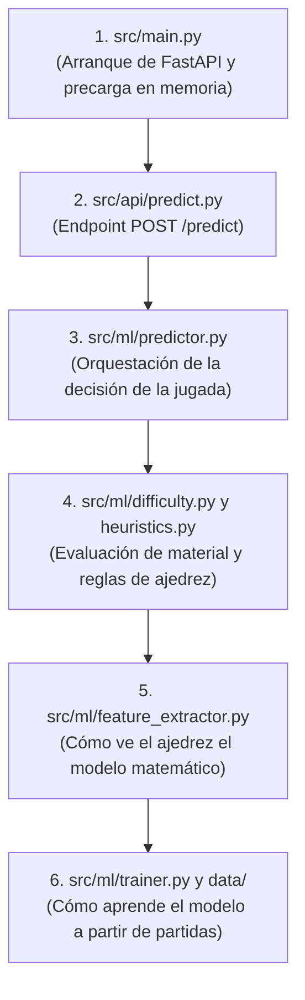
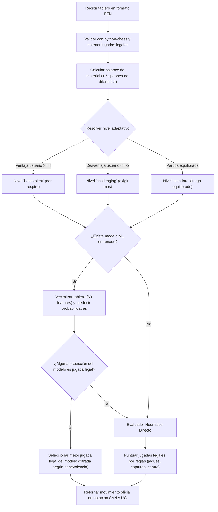

# EXPLICACION.md — Guía de Comprensión del Microservicio de IA

Esta guía está diseñada para que cualquier desarrollador —desde estudiantes y personas que recién comienzan a programar hasta ingenieros de software consolidados— pueda comprender qué hace el microservicio de **Inteligencia Artificial de Ajedrito**, cómo está organizado, cómo funciona su modelo de Machine Learning y cómo interactúa con el resto del sistema.

---

## 1. ¿Qué es el Microservicio de IA y qué problema resuelve?

Cuando jugamos al ajedrez contra una computadora, existen dos grandes aproximaciones:
1. **Motores de fuerza bruta y cálculo analítico exhaustivo (como Stockfish):** Son programas extraordinarios, pero juegan a un nivel prácticamente sobrehumano. Para un estudiante o jugador aficionado, jugar contra Stockfish puede resultar frustrante y poco didáctico.
2. **Modelos de Aprendizaje Automático (Machine Learning):** Aprenden a jugar analizando miles de partidas reales jugadas por humanos, replicando patrones, estilos y decisiones orgánicas.

El microservicio de **Ajedrito AI** resuelve tres problemas fundamentales:
* **Juego Pedagógico y Natural:** Proporciona un oponente sintético propio que juega como un ser humano, cometiendo errores comprensibles y ofreciendo una curva de aprendizaje amigable.
* **Dificultad Dinámica Adaptativa:** La IA evalúa la partida en cada turno; si nota que el usuario está en clara desventaja de piezas, adopta una postura "benevolente" (evita capturas destructivas para darle oportunidad de recuperarse). Si el usuario va ganando con comodidad, la IA eleva la exigencia táctica.
* **Garantía Absoluta de Legalidad (Cero Alucinaciones):** Los modelos de Machine Learning son probabilísticos y podrían sugerir una jugada imposible o ilegal. Ajedrito AI combina el modelo con la biblioteca formal `python-chess`, asegurando que el 100% de las jugadas sugeridas cumplan estrictamente el reglamento oficial de la FIDE.

---

## 2. Mapa del Territorio: ¿Cómo está organizada la carpeta `ai/`?

La carpeta [`ai/`](file:///c:/Users/teixi/Workspace/ProyectosEducativos/Ajedrito/ai) aloja un microservicio independiente programado en Python (utilizando **FastAPI**):

```text
ai/
├── models/                    # Almacén local del artefacto serializado (chess_model.joblib)
├── tests/                     # Pruebas automatizadas con pytest (39 tests unitarios)
├── src/
│   ├── config.py              # Configuración y variables de entorno con Pydantic Settings
│   ├── main.py                # Punto de entrada de FastAPI y gestión del ciclo de vida (lifespan)
│   ├── api/                   # Controladores REST de la API
│   │   ├── health.py          # Chequeo de estado del servicio (/health)
│   │   └── predict.py         # Endpoints principales: inferencia (/predict) y reentrenamiento (/train)
│   ├── core/                  # Módulos transversales de soporte
│   │   ├── constants.py       # Valores de piezas, pesos heurísticos y rutas fijas
│   │   └── logging.py         # Configuración centralizada de logs legibles
│   ├── data/                  # Ingesta, balanceo y siembra masiva de datos
│   │   ├── dataset_builder.py # Lee la BD y genera matrices numéricas para entrenamiento
│   │   └── seed_lichess_dataset.py # Descarga y siembra partidas reales de Lichess (Cold Start)
│   ├── ml/                    # Núcleo de Inteligencia Artificial y Machine Learning
│   │   ├── difficulty.py      # Gestor de dificultad adaptativa según balance de material
│   │   ├── feature_extractor.py # Transforma tableros FEN en vectores numéricos de 69 dimensiones
│   │   ├── heuristics.py      # Evaluador táctico y posicional por reglas (capturas, enroque, etc.)
│   │   ├── model_registry.py  # Administrador de carga y caché en memoria del modelo
│   │   ├── predictor.py       # Orquestador de la inferencia: modelo + filtros legales + heurística
│   │   └── trainer.py         # Entrenador del clasificador RandomForest (scikit-learn)
│   └── models/
│       └── schemas.py         # Contratos y esquemas de validación Pydantic (Request / Response)
```

---

## 3. ¿Por dónde empezar a leer el código? (Ruta pedagógica sugerida)

Para comprender cómo funciona el servicio sin perderse en detalles matemáticos, sigue esta secuencia:



1. **[`src/main.py`](file:///c:/Users/teixi/Workspace/ProyectosEducativos/Ajedrito/ai/src/main.py):** Aquí se inicia el servidor FastAPI. Observa la función `lifespan`: cuando el servidor enciende, precarga el archivo `.joblib` en la memoria RAM para que la primera petición de un usuario responda en milisegundos.
2. **[`src/api/predict.py`](file:///c:/Users/teixi/Workspace/ProyectosEducativos/Ajedrito/ai/src/api/predict.py):** Revisa el endpoint `POST /predict`. Notarás que es una función síncrona ordinaria (`def predict(...)`), lo que permite que FastAPI la ejecute en un hilo separado de Starlette para no bloquear el bucle de eventos asíncrono.
3. **[`src/ml/predictor.py`](file:///c:/Users/teixi/Workspace/ProyectosEducativos/Ajedrito/ai/src/ml/predictor.py):** Este es el corazón de la IA. Analiza cómo valida el FEN, consulta la dificultad adaptativa, pide probabilidades al modelo `RandomForest` y, si el modelo no estuviera disponible, recurre de forma segura al motor heurístico.
4. **[`src/ml/difficulty.py`](file:///c:/Users/teixi/Workspace/ProyectosEducativos/Ajedrito/ai/src/ml/difficulty.py) y [`src/ml/heuristics.py`](file:///c:/Users/teixi/Workspace/ProyectosEducativos/Ajedrito/ai/src/ml/heuristics.py):** Descubre cómo se calcula la diferencia de material y cómo se puntúan jugadas (capturas, jaques, control central, enroque y coronación) sin necesidad de una red neuronal.
5. **[`src/ml/feature_extractor.py`](file:///c:/Users/teixi/Workspace/ProyectosEducativos/Ajedrito/ai/src/ml/feature_extractor.py):** Aprende cómo una cadena de texto FEN se convierte en 69 números flotantes que un algoritmo de Machine Learning puede entender.

---

## 4. ¿Cómo "ve" el ajedrez una máquina? (El vector de 69 dimensiones)

Las computadoras no entienden qué es una "torre blanca en e4". Necesitan números. El archivo [`feature_extractor.py`](file:///c:/Users/teixi/Workspace/ProyectosEducativos/Ajedrito/ai/src/ml/feature_extractor.py) traduce cualquier posición a una lista de **69 números continuos**:

| Dimensiones | Qué representa | Explicación sencilla |
| :--- | :--- | :--- |
| **0 a 63 (64 casillas)** | Las 64 casillas del tablero (desde a1 hasta h8) | Si la casilla está vacía vale `0`. Si hay una pieza blanca tiene valor positivo (Peón = `+1`, Caballo/Alfil = `+3`, Torre = `+5`, Dama = `+9`, Rey = `+100`). Si la pieza es negra, tiene el mismo valor pero con signo negativo (`-1`, `-3`, etc.). |
| **Casilla 64 (1 número)** | El turno activo | `+1.0` si le toca mover a las blancas, `-1.0` si le toca a las negras. |
| **Casillas 65 a 68 (4 números)** | Derechos de enroque | 4 interruptores binarios (`1.0` o `0.0`) para saber si las blancas pueden enrocar corto/largo y si las negras pueden enrocar corto/largo. |

Gracias a este vector numérico fijo, cualquier posición de ajedrez se convierte en una fila matemática que el clasificador `RandomForest` puede procesar en una fracción de milisegundo.

---

## 5. El Flujo de Decisión: ¿Cómo elige la IA su jugada?

Cuando el backend le envía un tablero a la IA, se ejecuta el siguiente embudo de decisión inteligente:



### ¿Por qué este diseño es tan robusto?
1. **Nunca se cuelga:** Si el archivo `.joblib` se borra por accidente o no se ha entrenado aún, el sistema no lanza un error 500; activa automáticamente el evaluador heurístico determinista y sigue jugando a la perfección.
2. **Nunca hace trampa ni juega ilegal:** Aunque el modelo de Machine Learning proponga una jugada absurda, el código verifica que el movimiento figure en la lista de jugadas legales de la posición (`board.legal_moves`). Si no es legal, se descarta de inmediato.

---

## 6. La Dificultad Adaptativa: Un rival pedagógico

En [`src/ml/difficulty.py`](file:///c:/Users/teixi/Workspace/ProyectosEducativos/Ajedrito/ai/src/ml/difficulty.py) se encuentra la inteligencia pedagógica de Ajedrito:
* **Modo Benevolente (`benevolent`):** Si un niño o principiante pierde su dama o varias piezas (el balance de material favorece a la IA por más de 4 puntos), la IA modera su agresividad: en lugar de capturar otra pieza indefensa de inmediato, elige la segunda mejor opción o una jugada de desarrollo posicional para permitir que el estudiante continúe practicando sin frustrarse.
* **Modo Desafiante (`challenging`):** Si el usuario tiene clara ventaja o solicita máxima dificultad, la IA juega la variante táctica de mayor puntuación posible.

---

## 7. ¿Cómo aprende la IA? (Entrenamiento y Seeding)

Para que el modelo aprenda a jugar, necesita partidas previas. Ajedrito resuelve esto en dos etapas:

1. **Arranque en Frío (Cold Start con Lichess):**  
   Al iniciar un proyecto desde cero, la base de datos está vacía. El script [`src/data/seed_lichess_dataset.py`](file:///c:/Users/teixi/Workspace/ProyectosEducativos/Ajedrito/ai/src/data/seed_lichess_dataset.py) descarga partidas reales desde la API pública de Lichess de tres niveles de juego (cuentas oficiales calibradas `maia1`, `maia5` y `maia9`), inyectando miles de posiciones históricas etiquetadas como `source = 'SEED'`.
2. **Entrenamiento Continuo con Usuarios Reales:**  
   Cada vez que alguien juega una partida en Ajedrito, las jugadas se guardan con `source = 'USER'`. Cuando se invoca el endpoint `POST /train` o se ejecuta [`trainer.py`](file:///c:/Users/teixi/Workspace/ProyectosEducativos/Ajedrito/ai/src/ml/trainer.py), [`dataset_builder.py`](file:///c:/Users/teixi/Workspace/ProyectosEducativos/Ajedrito/ai/src/data/dataset_builder.py) lee la base de datos, prioriza todas las jugadas de personas reales, completa con jugadas de Lichess hasta un cupo balanceado, y entrena un nuevo bosque de árboles de decisión (`RandomForestClassifier`), guardándolo en `models/chess_model.joblib`.

---

## 8. ¿Dónde mirar si necesitas hacer modificaciones?

* **Si quieres cambiar cómo se vectoriza el tablero:**  
  👉 Edita [`src/ml/feature_extractor.py`](file:///c:/Users/teixi/Workspace/ProyectosEducativos/Ajedrito/ai/src/ml/feature_extractor.py).
* **Si quieres ajustar los puntajes de las piezas o las bonificaciones de enroque y centro:**  
  👉 Edita [`src/core/constants.py`](file:///c:/Users/teixi/Workspace/ProyectosEducativos/Ajedrito/ai/src/core/constants.py).
* **Si quieres modificar los umbrales de material para el cambio de dificultad:**  
  👉 Edita [`src/ml/difficulty.py`](file:///c:/Users/teixi/Workspace/ProyectosEducativos/Ajedrito/ai/src/ml/difficulty.py).
* **Si quieres cambiar el algoritmo de Machine Learning (ej. usar GradientBoosting o cambiar hiperparámetros):**  
  👉 Edita [`src/ml/trainer.py`](file:///c:/Users/teixi/Workspace/ProyectosEducativos/Ajedrito/ai/src/ml/trainer.py).
