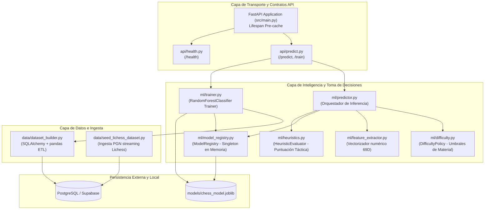

# PROYECTO.md — Documentación Técnica y de Ingeniería del Microservicio de IA

Este documento constituye la memoria técnica formal de ingeniería del **Microservicio de Inteligencia Artificial de Ajedrito**. Su objetivo es fundamentar los requisitos, la arquitectura, el diseño algorítmico, el procesamiento de datos y las decisiones de Machine Learning implementadas, adoptando la perspectiva del ingeniero de sistemas y especialista en datos responsable de su diseño.

---

## 1. Análisis y Requisitos

El microservicio de IA opera como un subsistema autónomo de inferencia y entrenamiento continuo, diseñado para interactuar de forma desacoplada con el backend de Ajedrito.

### 1.1. Requisitos Funcionales (RF-AI)
* **RF-AI-01 (Inferencia de Jugadas a partir de FEN):** Recibir una posición de ajedrez en formato de texto FEN y predecir la siguiente mejor jugada, devolviendo tanto la casilla origen (`from`), destino (`to`), eventual coronación (`promotion`), notación algebraica estándar (`san`), notación UCI (`uci`) y el grado de confianza asignado por el modelo.
* **RF-AI-02 (Garantía Estricta de Legalidad FIDE):** Ninguna jugada emitida por el servicio puede violar el reglamento de la FIDE. El sistema debe interceptar y filtrar las probabilidades del modelo de Machine Learning contra la lista exhaustiva de jugadas legales generadas por el motor de reglas formales (`python-chess`).
* **RF-AI-03 (Política de Dificultad Dinámica y Pedagógica):** Modular la agresividad y profundidad táctica de las respuestas según una política adaptativa basada en el balance de material en tiempo real (`benevolent`, `standard`, `challenging`), con el fin de evitar la frustración de estudiantes principiantes.
* **RF-AI-04 (Evaluador Heurístico Determinista de Respaldo):** Implementar un motor posicional y táctico puro (sin dependencias de modelos externos) que funcione como fallback transparente cuando no exista un modelo entrenado en disco o ante anomalías de inferencia.
* **RF-AI-05 (Pipeline Batch de Reentrenamiento en Caliente):** Ofrecer un endpoint de entrenamiento (`POST /train`) que consulte el historial de jugadas persistidas en la base de datos PostgreSQL, construya una muestra balanceada, entrene un clasificador supervisado, persista el artefacto serializado y actualice la memoria en caliente sin reiniciar el proceso.
* **RF-AI-06 (Mecanismo de Ingesta y Cold Start):** Suministrar un pipeline automatizado de ingesta masiva capaz de descargar y estructurar partidas reales de jugadores de distintos niveles Elo desde la API pública de Lichess (`maia1`, `maia5`, `maia9`), resolviendo el problema de arranque en frío.

### 1.2. Requisitos No Funcionales (RNF-AI)
* **RNF-AI-01 (Latencia de Inferencia en Tiempo Real):** El tiempo de cálculo de la inferencia (`POST /predict`) debe ser inferior a 30 ms en un entorno estándar de CPU, sin depender de aceleradores de hardware como GPUs dedicadas.
* **RNF-AI-02 (Concurrencia sin Bloqueo de Event Loop):** Al tratarse de operaciones intensivas en CPU (CPU-bound) como la vectorización de matrices y el cálculo probabilístico, las peticiones no deben bloquear el bucle de eventos asíncrono (`asyncio`) del servidor HTTP.
* **RNF-AI-03 (Resiliencia Operativa y Tolerancia a Fallos):** La ausencia física del archivo del modelo serializado no debe impedir el arranque ni el funcionamiento del servicio.
* **RNF-AI-04 (Huella de Memoria Optimizada):** El consumo de memoria RAM del servicio en reposo e inferencia no debe superar los 250 MB.

---

## 2. Arquitectura del Sistema

El servicio está implementado con el framework moderno **FastAPI** (Python 3.13), estructurado bajo un diseño modular desacoplado:



### Justificación de la Separación Arquitectónica:
* **Aislamiento de Cómputo CPU-bound:** Alojar los cálculos matemáticos en un microservicio de Python independiente del backend de Node.js evita que el bucle de eventos mono-hilo de Express sufra retardos o degradación de latencia al servir sockets o consultas I/O concurrentes.
* **Desacoplamiento del Modelo:** El orquestador `predictor.py` desconoce los detalles internos del clasificador `RandomForestClassifier`. Solo consume la interfaz estandarizada de scikit-learn (`predict_proba` / `classes_`) proporcionada por el registro `ModelRegistry`.

---

## 3. Diseño Técnico y Algorítmico

### 3.1. Vectorización de Estados de Ajedrez (Espacio de Características de 69 Dimensiones)
Para que un algoritmo supervisado pueda clasificar posiciones, la notación FEN debe transformarse en un tensor continuo numérico de tamaño fijo. Se diseñó un extractor vectorial de 69 variables ([`src/ml/feature_extractor.py`](file:///c:/Users/teixi/Workspace/ProyectosEducativos/Ajedrito/ai/src/ml/feature_extractor.py)):

$$\vec{X} = [x_0, x_1, \dots, x_{63}, x_{64}, x_{65}, x_{66}, x_{67}, x_{68}] \in \mathbb{R}^{69}$$

1. **Casillas del Tablero ($x_0$ a $x_{63}$):** Representan las 64 casillas del tablero en orden canónico (a1=0 a h8=63).
   * Casilla vacía = $0$.
   * Piezas Blancas: Peón $= +1$, Caballo $= +3$, Alfil $= +3$, Torre $= +5$, Dama $= +9$, Rey $= +100$.
   * Piezas Negras: Los mismos valores absolutos con signo negativo ($-1, -3, -5, -9, -100$).
2. **Indicador de Turno Activo ($x_{64}$):** $+1.0$ para Blancas, $-1.0$ para Negras.
3. **Derechos de Enroque ($x_{65}$ a $x_{68}$):** 4 variables binarias $\{0.0, 1.0\}$ que codifican si los reyes blanco y negro conservan el derecho a enroque corto o largo.

### 3.2. Arquitectura del Modelo de Machine Learning
Se seleccionó un clasificador de ensamble **RandomForest** entrenado en modo multiclase, donde cada clase representa una jugada en notación UCI (por ejemplo, `"e2e4"`, `"g1f3"`).
* **Hiperparámetros Calibrados ([`src/ml/trainer.py`](file:///c:/Users/teixi/Workspace/ProyectosEducativos/Ajedrito/ai/src/ml/trainer.py)):**
  ```python
  RandomForestClassifier(
      n_estimators=35,       # Balance ideal entre varianza reducida y tiempo de inferencia
      max_depth=12,          # Previene sobreajuste a aperturas específicas
      max_leaf_nodes=400,    # Limita la complejidad del árbol en memoria
      min_samples_split=8,   # Evita divisiones basadas en casos atípicos aislados
      min_samples_leaf=2,    # Suaviza las hojas terminales
      random_state=42,       # Reproducibilidad estricta
      n_jobs=-1              # Paralelización en todos los núcleos de CPU disponibles
  )
  ```
* **Justificación de Hiperparámetros:** Esta configuración produce un artefacto `.joblib` ligero (~15 MB) cuya predicción de probabilidades (`predict_proba`) toma menos de 4 ms en CPU, cumpliendo sobradamente con RNF-AI-01.

### 3.3. Motor Heurístico de Respaldo y Puntuación Táctica
Cuando el modelo no está disponible o ninguna de sus predicciones más probables es legal en la posición dada, [`src/ml/heuristics.py`](file:///c:/Users/teixi/Workspace/ProyectosEducativos/Ajedrito/ai/src/ml/heuristics.py) evalúa todas las jugadas legales $m \in M_{\text{legal}}$ asignando una puntuación táctico-posicional:

$$S(m) = S_{\text{captura}}(m) + S_{\text{jaque}}(m) + S_{\text{centro}}(m) + S_{\text{enroque}}(m) + S_{\text{promoción}}(m)$$

* **Valores Ponderados ([`src/core/constants.py`](file:///c:/Users/teixi/Workspace/ProyectosEducativos/Ajedrito/ai/src/core/constants.py)):**
  * Captura de pieza: $\text{Valor Pieza Capturada} \times 10$ (Dama = 900, Torre = 500, etc.).
  * En passant: $+10$ puntos.
  * Jaque al rey adversario: $+15$ puntos.
  * Ocupación o control de casillas centrales ($d4, d5, e4, e5$): $+5$ puntos.
  * Enroque de rey: $+12$ puntos.
  * Promoción de peón: $+80$ puntos.

### 3.4. Política de Dificultad Dinámica Adaptativa
[`DifficultyPolicy.resolve_adaptive_level`](file:///c:/Users/teixi/Workspace/ProyectosEducativos/Ajedrito/ai/src/ml/difficulty.py) computa el balance material actual:

$$B_{\text{material}} = \sum \text{Piezas}(\text{Turno}) - \sum \text{Piezas}(\text{Oponente})$$

* Si la dificultad configurada es `"adaptive"`:
  * Si $B_{\text{material}} \ge +4$ (el usuario va perdiendo por 4 o más puntos de material): se activa el modo **`benevolent`**. En este modo, el predictor selecciona la segunda mejor jugada legal no destructiva, evitando castigar al usuario principiante.
  * Si $B_{\text{material}} \le -2$ (el usuario tiene ventaja material clara): se activa el modo **`challenging`**, seleccionando la jugada de máxima agresividad táctica.
  * En cualquier otro rango: se opera en modo **`standard`**.

### 3.5. Prevención de Bloqueo del Event Loop en FastAPI
En [`src/api/predict.py`](file:///c:/Users/teixi/Workspace/ProyectosEducativos/Ajedrito/ai/src/api/predict.py), los endpoints están declarados como funciones síncronas estándar (`def predict(...)` y `def train(...)`) en lugar de corutinas `async def`.
* **Razón de Ingeniería:** En FastAPI (construido sobre Starlette/AnyIO), declarar una ruta intensiva en CPU con `async def` provocaría que el cálculo de `RandomForest` bloquease el bucle de eventos principal de `asyncio`, congelando todas las demás peticiones entrantes. Al declararla como `def`, FastAPI la despacha automáticamente a un *worker threadpool* en segundo plano, manteniendo el bucle de eventos libre para aceptar nuevas conexiones HTTP.

---

## 4. Modelado y Gestión de Datos

### 4.1. Esquemas de Datos Pydantic v2 ([`src/models/schemas.py`](file:///c:/Users/teixi/Workspace/ProyectosEducativos/Ajedrito/ai/src/models/schemas.py))
Los contratos de entrada y salida están tipados y validados estrictamente con Pydantic:

* **`PredictRequest`:**
  * `fen` (string, obligatorio): Posición en notación FEN.
  * `game_id` (string opcional): Identificador de la partida para correlación de logs.
  * `difficulty` (string opcional, default `"adaptive"`): Política solicitada.
* **`PredictResponse`:**
  * Usa `ConfigDict(populate_by_name=True)`.
  * Define los campos `from_square` y `to_square` con los alias `"from"` y `"to"`. De este modo, la respuesta serializada en JSON genera las claves exactas que espera el backend de Node.js (`from`, `to`), respetando las palabras reservadas del lenguaje Python.

### 4.2. Pipeline de Construcción de Dataset ([`src/data/dataset_builder.py`](file:///c:/Users/teixi/Workspace/ProyectosEducativos/Ajedrito/ai/src/data/dataset_builder.py))
Conecta a PostgreSQL mediante SQLAlchemy en modo lectura y ejecuta una consulta optimizada sobre la tabla `moves` cruzada con `games`:
1. Recupera `fen_before` y `san`.
2. **Estrategia de Muestreo Equilibrado:** Si el número de jugadas disponibles supera `max_samples` (12.000 por defecto), el pipeline extrae **todas** las jugadas de usuarios reales (`source = 'USER'`) y completa el remanente muestreando aleatoriamente partidas sembradas de Lichess (`source = 'SEED'`).
3. Vectoriza cada tablero FEN en su representación de 69 floats, retornando matrices NumPy `X` y etiquetas UCI `y`.

---

## 5. Componentes y Responsabilidades (Matriz SRP)

| Archivo / Módulo | Responsabilidad Única (SRP) | Dependencias Principales |
| :--- | :--- | :--- |
| [`src/main.py`](file:///c:/Users/teixi/Workspace/ProyectosEducativos/Ajedrito/ai/src/main.py) | Punto de entrada, configuración de CORS y precarga en memoria en el ciclo de vida `lifespan`. | `fastapi`, `model_registry` |
| [`api/predict.py`](file:///c:/Users/teixi/Workspace/ProyectosEducativos/Ajedrito/ai/src/api/predict.py) | Controladores REST para endpoints de inferencia y disparo de entrenamiento batch. | `fastapi`, `predictor`, `trainer` |
| [`api/health.py`](file:///c:/Users/teixi/Workspace/ProyectosEducativos/Ajedrito/ai/src/api/health.py) | Verificación de liveness y readiness del microservicio. | `fastapi` |
| [`ml/predictor.py`](file:///c:/Users/teixi/Workspace/ProyectosEducativos/Ajedrito/ai/src/ml/predictor.py) | Orquestación de la inferencia, validación FIDE, filtrado por confianza y fallback heurístico. | `chess`, `model_registry`, `difficulty`, `heuristics` |
| [`ml/difficulty.py`](file:///c:/Users/teixi/Workspace/ProyectosEducativos/Ajedrito/ai/src/ml/difficulty.py) | Evaluación del balance de material y determinación del nivel adaptativo pedagógico. | `constants` |
| [`ml/heuristics.py`](file:///c:/Users/teixi/Workspace/ProyectosEducativos/Ajedrito/ai/src/ml/heuristics.py) | Evaluación y ordenamiento determinista de jugadas legales por reglas tácticas y posicionales. | `chess`, `constants` |
| [`ml/feature_extractor.py`](file:///c:/Users/teixi/Workspace/ProyectosEducativos/Ajedrito/ai/src/ml/feature_extractor.py) | Conversión pura de tableros de ajedrez a vectores numéricos de 69 dimensiones. | `numpy`, `chess`, `constants` |
| [`ml/model_registry.py`](file:///c:/Users/teixi/Workspace/ProyectosEducativos/Ajedrito/ai/src/ml/model_registry.py) | Gestión del ciclo de vida del archivo joblib y caché en memoria (Singleton/Registry). | `joblib`, `constants` |
| [`ml/trainer.py`](file:///c:/Users/teixi/Workspace/ProyectosEducativos/Ajedrito/ai/src/ml/trainer.py) | Ajuste del estimador RandomForestClassifier, evaluación de precisión y persistencia del modelo. | `sklearn`, `dataset_builder`, `model_registry` |
| [`data/dataset_builder.py`](file:///c:/Users/teixi/Workspace/ProyectosEducativos/Ajedrito/ai/src/data/dataset_builder.py) | Extracción y vectorización masiva de jugadas desde la base de datos Supabase. | `sqlalchemy`, `pandas`, `feature_extractor` |
| [`data/seed_lichess_dataset.py`](file:///c:/Users/teixi/Workspace/ProyectosEducativos/Ajedrito/ai/src/data/seed_lichess_dataset.py) | Ingesta masiva desde API de Lichess e inserción bulk mediante psycopg2 para mitigar arranque en frío. | `psycopg2`, `chess.pgn` |

---

## 6. Interfaces y Contratos de la API

### 6.1. `POST /predict`
* **Request:**
  ```json
  {
    "fen": "rnbqkbnr/pppppppp/8/8/4P3/8/PPPP1PPP/RNBQKBNR b KQkq e3 0 1",
    "game_id": "c8d3e210-91fc-4708-9b88-123456789abc",
    "difficulty": "adaptive"
  }
  ```
* **Response (200 OK):**
  ```json
  {
    "san": "e5",
    "uci": "e7e5",
    "from": "e7",
    "to": "e5",
    "promotion": null,
    "confidence": 0.7812,
    "method": "ml",
    "adaptive_level": "standard"
  }
  ```
* **Errores Controlados:**
  * `400 Bad Request`: Formato FEN inválido o posición correspondiente a partida ya terminada.
  * `500 Internal Server Error`: Falla no recuperable durante la inferencia.

### 6.2. `POST /train`
* **Response (200 OK):**
  ```json
  {
    "status": "success",
    "dataset_size": 9420,
    "seed_moves": 8500,
    "user_moves": 920,
    "classes_count": 842,
    "train_accuracy": 0.8945,
    "model_path": "C:\\...\\ai\\models\\chess_model.joblib",
    "message": null
  }
  ```

---

## 7. Patrones de Diseño Implementados

1. **Model Registry Pattern ([`ModelRegistry`](file:///c:/Users/teixi/Workspace/ProyectosEducativos/Ajedrito/ai/src/ml/model_registry.py)):**
   * *Problema:* Deserializar un archivo joblib desde disco en cada petición HTTP añade entre 50 ms y 150 ms de I/O innecesario.
   * *Solución:* Mantiene una única instancia en memoria RAM compartida (Singleton en memoria). Al reentrenar el modelo, el método `set_model()` actualiza la referencia atómicamente sin reiniciar el servidor.
2. **Policy Pattern ([`DifficultyPolicy`](file:///c:/Users/teixi/Workspace/ProyectosEducativos/Ajedrito/ai/src/ml/difficulty.py)):**
   * *Problema:* Separar la heurística de cálculo de dificultad de la lógica de inferencia del clasificador.
   * *Solución:* Encapsula las reglas de umbral de material en una clase estática pura e independiente, facilitando pruebas unitarias exhaustivas.
3. **Pipeline Pattern ([`dataset_builder.py`](file:///c:/Users/teixi/Workspace/ProyectosEducativos/Ajedrito/ai/src/data/dataset_builder.py)):**
   * *Problema:* Transformar registros relacionales no estructurados de PostgreSQL en matrices de tensores optimizadas para scikit-learn.
   * *Solución:* Cadena de extracción (SQL), filtrado, ponderación por fuente, parseo con `python-chess` y vectorización matemática de 69 dimensiones.

---

## 8. Decisiones Técnicas y Justificaciones Profesionales

* **¿Por qué RandomForestClassifier en lugar de una Red Neuronal Profunda (Deep Learning)?**
  * *Justificación:* Las redes neuronales profundas (como arquitecturas CNN o Transformers de ajedrez) demandan cientos de megabytes de pesos sinápticos, tiempos de entrenamiento de horas y GPUs dedicadas para inferencia de baja latencia. El `RandomForestClassifier` de scikit-learn ofrece inferencia instantánea en CPU (menos de 4 ms), bajo consumo de memoria RAM (< 200 MB), excelente inmunidad al sobreajuste mediante muestreo aleatorio de características y capacidad de operar con datasets medianos (10.000 jugadas) con precisión táctica sólida.
* **¿Por qué FastAPI en lugar de Flask o Django?**
  * *Justificación:* FastAPI ofrece validación estricta de esquemas en tiempo de ejecución con Pydantic v2, generación automática de documentación OpenAPI, y gestión nativa de ciclo de vida (`lifespan`) para precargar modelos antes de abrir el puerto de red.
* **¿Por qué combinar Machine Learning con un filtro estricto de `python-chess`?**
  * *Justificación:* Los clasificadores estadísticos asignan probabilidades a cadenas de texto UCI basándose en patrones históricos; si un tablero presenta una posición atípica, el modelo podría predecir con baja probabilidad un movimiento ilegal para esa posición concreta. El filtro de intersección contra `board.legal_moves` erradica el problema de "alucinación" y garantiza que el microservicio jamás emita una jugada contraria al reglamento de la FIDE.

---

## 9. Restricciones y Mantenimiento Futuro

1. **Dependencia de la Base de Datos para Reentrenar:** La función `train_model()` requiere acceso a la cadena de conexión `database_url`. Si la base de datos no está disponible, el entrenamiento no puede completarse, pero la inferencia continúa funcionando con el modelo en memoria o mediante el evaluador heurístico.
2. **Evolución Futura Sugerida:** Podría implementarse un algoritmo de búsqueda con poda alfa-beta (Alpha-Beta Pruning) de 1 o 2 niveles de profundidad sobre la función de puntuación del `HeuristicEvaluator` para dotar a la IA de visión táctica ante celadas complejas sin elevar drásticamente el tiempo de cálculo.
