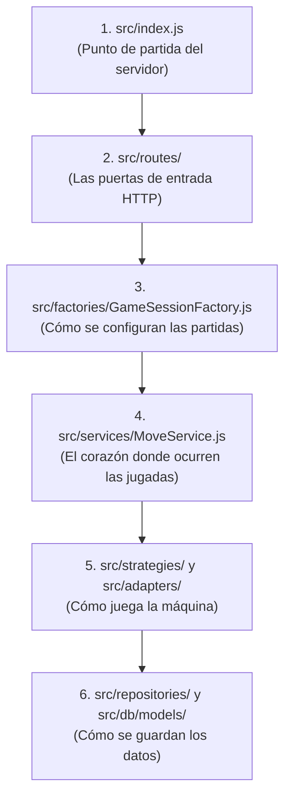
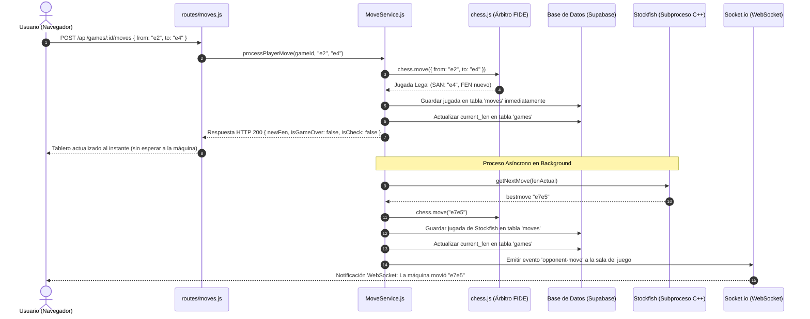

# EXPLICACION.md — Guía de Comprensión del Backend de Ajedrito

Esta guía está diseñada para que cualquier desarrollador —desde quien recién da sus primeros pasos en programación hasta perfiles con experiencia— pueda comprender con claridad qué hace el backend de Ajedrito, cómo está construido, por qué tiene esta estructura y cómo navegar por su código sin perderse.

---

## 1. ¿Qué es el Backend de Ajedrito y qué problema resuelve?

En una aplicación de ajedrez en línea, no basta con dibujar un tablero bonito en el navegador. Si dejáramos que el navegador de cada usuario decida si una jugada es válida o determine quién ganó, nos enfrentaríamos a múltiples problemas:
* Cualquier usuario podría alterar las reglas o enviar movimientos ilegales.
* No tendríamos un registro fidedigno de las partidas para reanudarlas o entrenar modelos de Inteligencia Artificial.
* No podríamos conectar motores profesionales de ajedrez (como Stockfish) ni modelos predictivos de Machine Learning de forma segura y eficiente.

El **backend de Ajedrito** actúa como el **árbitro oficial, el historiador y el director de orquesta** del sistema:
1. **Es el Árbitro:** Cada jugada enviada por un usuario es verificada formalmente con las reglas internacionales de la FIDE (Federación Internacional de Ajedrez). Si la jugada es ilegal, la rechaza.
2. **Es el Historiador:** Registra cada movimiento en una base de datos relacional (PostgreSQL en Supabase) en el instante exacto en que ocurre.
3. **Es el Orquestador:** Decide a quién le toca jugar y coordina el turno del oponente, ya sea otro ser humano en el mismo dispositivo, el motor internacional **Stockfish**, o el microservicio de **IA propia**.
4. **Es el Comunicador en Tiempo Real:** Utiliza WebSockets (mediante **Socket.io**) para avisarle al navegador en milisegundos cuando la máquina ha terminado de calcular su respuesta.

---

## 2. Mapa del Territorio: ¿Cómo está organizado?

Si abres la carpeta [`backend/`](file:///c:/Users/teixi/Workspace/ProyectosEducativos/Ajedrito/backend), encontrarás la siguiente estructura modular:

```text
backend/
├── bin/                       # Binarios ejecutables nativos (Stockfish para Windows)
├── scripts/                   # Scripts auxiliares (descarga del motor, migraciones)
├── tests/                     # Batería de pruebas unitarias automatizadas (Jest)
├── src/
│   ├── config/                # Carga de variables de entorno y conexión a la base de datos
│   ├── constants/             # Constantes del dominio (FEN inicial, valores estándar)
│   ├── db/                    # Modelos ORM (Sequelize) y migraciones de base de datos
│   │   ├── migrations/        # Historial de cambios en el esquema de base de datos
│   │   └── models/            # Definición de tablas: Game, Move, DifficultyProfile...
│   ├── routes/                # Controladores HTTP de Express (los puntos de entrada)
│   ├── services/              # Cerebro de negocio: MoveService y GameStateEvaluator
│   ├── factories/             # Fábricas de objetos: GameSessionFactory
│   ├── strategies/            # Estrategias de oponentes: Stockfish, CustomAI, Human
│   ├── adapters/              # Adaptadores de comunicación externa (Stockfish CLI, FastAPI REST)
│   ├── repositories/          # Capa de acceso a datos aislada (GameRepository, MoveRepository)
│   ├── middleware/            # Filtros globales (manejador centralizado de errores)
│   └── index.js               # Punto de entrada principal del servidor Express + Socket.io
```

---

## 3. ¿Por dónde empezar a leer el código? (Ruta pedagógica sugerida)

Para no abrumarte, te recomendamos seguir este recorrido paso a paso:



1. **[`src/index.js`](file:///c:/Users/teixi/Workspace/ProyectosEducativos/Ajedrito/backend/src/index.js):** Observa cómo se levanta el servidor Express, cómo se monta el servidor HTTP y cómo se configura Socket.io para escuchar conexiones.
2. **[`src/routes/games.js`](file:///c:/Users/teixi/Workspace/ProyectosEducativos/Ajedrito/backend/src/routes/games.js) y [`src/routes/moves.js`](file:///c:/Users/teixi/Workspace/ProyectosEducativos/Ajedrito/backend/src/routes/moves.js):** Mira qué endpoints existen (`POST /api/games`, `POST /api/games/:id/moves`, `GET /api/games/:id`). Notarás que las rutas son muy delgadas: solo reciben los datos, validan lo básico y delegan a los servicios.
3. **[`src/factories/GameSessionFactory.js`](file:///c:/Users/teixi/Workspace/ProyectosEducativos/Ajedrito/backend/src/factories/GameSessionFactory.js):** Entiende cómo el sistema traduce un modo de juego (`PVP`, `PV_STOCKFISH`, `PV_AI`) en una partida viva con la estrategia adecuada.
4. **[`src/services/MoveService.js`](file:///c:/Users/teixi/Workspace/ProyectosEducativos/Ajedrito/backend/src/services/MoveService.js):** Este es el archivo clave. Aquí se procesa cada movimiento, se guarda en base de datos y se dispara en segundo plano el turno del oponente.
5. **[`src/strategies/`](file:///c:/Users/teixi/Workspace/ProyectosEducativos/Ajedrito/backend/src/strategies) y [`src/adapters/`](file:///c:/Users/teixi/Workspace/ProyectosEducativos/Ajedrito/backend/src/adapters):** Descubre cómo el backend habla mediante líneas de comando con Stockfish ([`StockfishAdapter.js`](file:///c:/Users/teixi/Workspace/ProyectosEducativos/Ajedrito/backend/src/adapters/StockfishAdapter.js)) o vía peticiones HTTP con la IA propia en Python ([`AIServiceAdapter.js`](file:///c:/Users/teixi/Workspace/ProyectosEducativos/Ajedrito/backend/src/adapters/AIServiceAdapter.js)).
6. **[`src/repositories/`](file:///c:/Users/teixi/Workspace/ProyectosEducativos/Ajedrito/backend/src/repositories):** Observa cómo se aísla la base de datos para que el resto del sistema no tenga que escribir consultas SQL o Sequelize directas.

---

## 4. Conceptos Técnicos de Ajedrez que necesitas conocer

Para entender el código, hay tres términos fundamentales del ajedrez digital:

* **FEN (Forsyth-Edwards Notation):** Es una cadena de texto que describe exactamente una posición completa del tablero en una sola línea (piezas, a quién le toca mover, si se puede enrocar, casillas al paso).  
  * *Ejemplo inicial:* `"rnbqkbnr/pppppppp/8/8/8/8/PPPPPPPP/RNBQKBNR w KQkq - 0 1"`
* **SAN (Standard Algebraic Notation):** Es la notación humana tradicional de ajedrez.  
  * *Ejemplos:* `"e4"`, `"Nf3"` (caballo a f3), `"O-O"` (enroque corto), `"Qxf7#"` (dama captura en f7 con jaque mate).
* **UCI (Universal Chess Interface):** Protocolo estándar de comunicación con motores de ajedrez. No usa símbolos de piezas, sino solo las casillas de origen y destino.  
  * *Ejemplos:* `"e2e4"`, `"g1f3"`, `"e7e8q"` (peón corona dama).

---

## 5. Patrones de Diseño: Explicados de manera sencilla

El backend no amontona todo el código en un solo archivo; utiliza patrones de diseño para que cada parte tenga una sola responsabilidad clara:

### A. Patrón Estrategia (Strategy Pattern)
* **¿Qué problema resuelve?** Dependiendo del modo elegido por el usuario, el oponente puede ser un amigo en la misma computadora, un motor C++ híper rápido (Stockfish), o un modelo en Python. Si usáramos un montón de `if/else` gigantescos en cada jugada, el código sería imposible de mantener.
* **¿Cómo lo soluciona?** Define una clase base común ([`OpponentStrategy`](file:///c:/Users/teixi/Workspace/ProyectosEducativos/Ajedrito/backend/src/strategies/OpponentStrategy.js)) con un método `getNextMove(fen)`. Luego crea tres implementaciones independientes: [`HumanOpponent`](file:///c:/Users/teixi/Workspace/ProyectosEducativos/Ajedrito/backend/src/strategies/HumanOpponent.js), [`StockfishOpponent`](file:///c:/Users/teixi/Workspace/ProyectosEducativos/Ajedrito/backend/src/strategies/StockfishOpponent.js) y [`CustomAIOpponent`](file:///c:/Users/teixi/Workspace/ProyectosEducativos/Ajedrito/backend/src/strategies/CustomAIOpponent.js). Para [`MoveService`](file:///c:/Users/teixi/Workspace/ProyectosEducativos/Ajedrito/backend/src/services/MoveService.js), todos los oponentes se comportan igual: se les pide una jugada y la devuelven.

### B. Patrón Fábrica (Factory Pattern)
* **¿Qué problema resuelve?** Alguien tiene que saber qué piezas crear, qué estrategia instanciar y qué valores asignar cuando se inicia una partida.
* **¿Cómo lo soluciona?** La clase [`GameSessionFactory`](file:///c:/Users/teixi/Workspace/ProyectosEducativos/Ajedrito/backend/src/factories/GameSessionFactory.js) recibe la configuración deseada y "fabrica" la sesión completa con sus dependencias listas para jugar.

### C. Patrón Adaptador (Adapter Pattern)
* **¿Qué problema resuelve?** Stockfish es un programa ejecutable `.exe` que habla por línea de comandos (stdin/stdout), mientras que la IA propia es un servidor web FastAPI que habla JSON por HTTP.
* **¿Cómo lo soluciona?** Los adaptadores ([`StockfishAdapter`](file:///c:/Users/teixi/Workspace/ProyectosEducativos/Ajedrito/backend/src/adapters/StockfishAdapter.js) y [`AIServiceAdapter`](file:///c:/Users/teixi/Workspace/ProyectosEducativos/Ajedrito/backend/src/adapters/AIServiceAdapter.js)) "traducen" esas interfaces tan diferentes a objetos limpios de JavaScript `{ from, to, promotion }`.

### D. Patrón Repositorio (Repository Pattern)
* **¿Qué problema resuelve?** Si cambiáramos de base de datos o de ORM en el futuro, no queremos tener que reescribir toda la lógica de negocio del juego.
* **¿Cómo lo soluciona?** [`GameRepository`](file:///c:/Users/teixi/Workspace/ProyectosEducativos/Ajedrito/backend/src/repositories/GameRepository.js) y [`MoveRepository`](file:///c:/Users/teixi/Workspace/ProyectosEducativos/Ajedrito/backend/src/repositories/MoveRepository.js) concentran las operaciones sobre la base de datos (crear partida, guardar movimiento, actualizar FEN, marcar final).

---

## 6. Flujo de Información: Paso a paso con un ejemplo real

Imagina que estás jugando con blancas contra Stockfish y mueves tu peón de **e2 a e4**. ¿Qué sucede tras bambalinas?



### ¿Por qué este flujo es excelente?
Observa el paso 8: el servidor le responde al navegador **antes** de que Stockfish empiece a pensar. Esto garantiza que la interfaz de usuario se sienta instantánea y fluida. Luego, cuando el motor termina (pasos 9 al 14), el WebSocket actualiza el tablero automáticamente.

---

## 7. Manejo Centralizado de Errores

Para evitar que el servidor se caiga ante entradas inválidas o que los errores devuelvan formatos inconsistentes:
1. Se utiliza la clase personalizada [`AppError`](file:///c:/Users/teixi/Workspace/ProyectosEducativos/Ajedrito/backend/src/middleware/errorHandler.js), que asocia un código de estado HTTP (por ejemplo `400` para jugada ilegal o `404` para partida no encontrada) con un mensaje claro en español.
2. Si un error imprevisto ocurre (por ejemplo, una falla de conexión con la base de datos), el middleware [`errorHandler`](file:///c:/Users/teixi/Workspace/ProyectosEducativos/Ajedrito/backend/src/middleware/errorHandler.js) captura la excepción, la registra en la consola del servidor y devuelve una respuesta segura `500 - Error interno del servidor` sin exponer detalles sensibles al exterior.

---

## 8. ¿Dónde mirar si necesitas hacer cambios?

* **Si quieres cambiar cómo se evalúa un fin de partida (tablas, jaque mate):**  
  👉 Revisa [`src/services/GameStateEvaluator.js`](file:///c:/Users/teixi/Workspace/ProyectosEducativos/Ajedrito/backend/src/services/GameStateEvaluator.js).
* **Si quieres modificar los niveles o tiempos de respuesta de Stockfish:**  
  👉 Revisa [`src/adapters/StockfishAdapter.js`](file:///c:/Users/teixi/Workspace/ProyectosEducativos/Ajedrito/backend/src/adapters/StockfishAdapter.js) y los perfiles de la base de datos en [`src/db/models/DifficultyProfile.js`](file:///c:/Users/teixi/Workspace/ProyectosEducativos/Ajedrito/backend/src/db/models/DifficultyProfile.js).
* **Si quieres cambiar la URL o el timeout de la IA propia en Python:**  
  👉 Revisa [`src/config/env.js`](file:///c:/Users/teixi/Workspace/ProyectosEducativos/Ajedrito/backend/src/config/env.js) y [`src/adapters/AIServiceAdapter.js`](file:///c:/Users/teixi/Workspace/ProyectosEducativos/Ajedrito/backend/src/adapters/AIServiceAdapter.js).
* **Si quieres agregar una nueva columna a las partidas o jugadas:**  
  👉 Agrega una migración en [`src/db/migrations/`](file:///c:/Users/teixi/Workspace/ProyectosEducativos/Ajedrito/backend/src/db/migrations) y actualiza el modelo en [`src/db/models/`](file:///c:/Users/teixi/Workspace/ProyectosEducativos/Ajedrito/backend/src/db/models).
