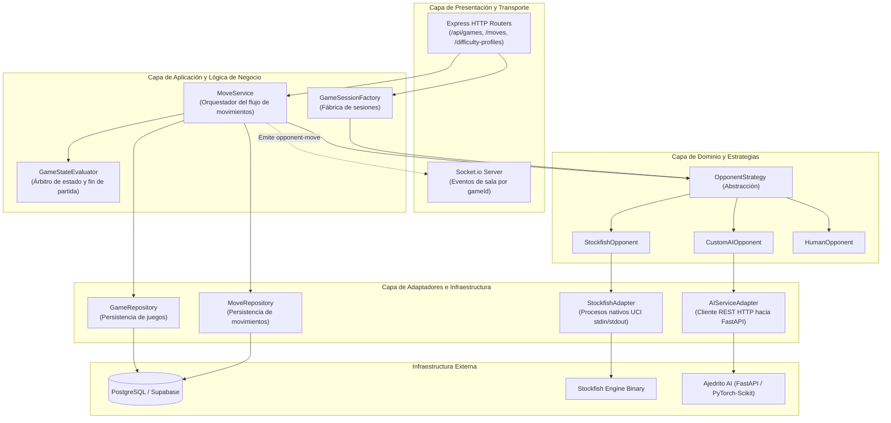
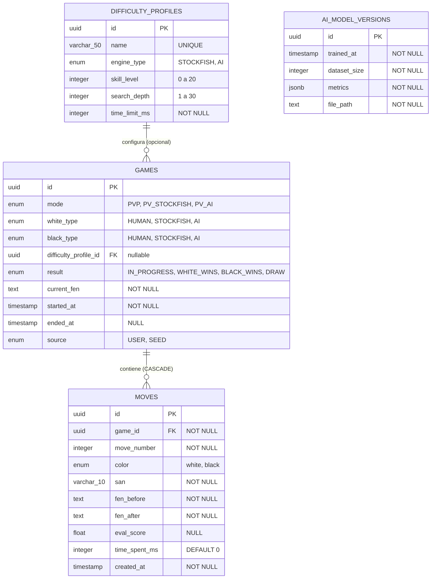

# PROYECTO.md — Documentación Técnica y de Ingeniería del Backend

Este documento constituye la memoria técnica formal de ingeniería del **Backend de Ajedrito**. Su objetivo es fundamentar los requisitos, la arquitectura, el diseño de datos, las reglas de negocio y las decisiones técnicas que estructuran el servicio, adoptando la perspectiva del ingeniero responsable de su diseño e implementación.

---

## 1. Análisis y Requisitos

El backend de Ajedrito es el nodo central de orquestación, arbitraje y persistencia del ecosistema de ajedrez. Su diseño responde a los siguientes requisitos de ingeniería:

### 1.1. Requisitos Funcionales (RF)
* **RF-01 (Gestión de Sesiones de Juego):** Crear, inicializar y recuperar el estado completo de partidas en tres modalidades: Jugador vs Jugador local (`PVP`), Jugador vs Motor Stockfish (`PV_STOCKFISH`) y Jugador vs IA Propia (`PV_AI`).
* **RF-02 (Arbitraje Oficial FIDE):** Validar con precisión matemática la legalidad de cada movimiento humano según las normas internacionales de ajedrez (movimiento de piezas, jaque, jaque descubierto, enroques válidos/inválidos, capturas al paso y promociones).
* **RF-03 (Persistencia Granular de Jugadas):** Registrar en base de datos cada movimiento en el momento exacto en que ocurre, registrando FEN previo, FEN posterior, notación SAN, tiempo empleado y número correlativo de jugada.
* **RF-04 (Detección Exhaustiva de Fin de Partida):** Evaluar de forma determinista la terminación de una partida identificando Jaque Mate (`WHITE_WINS` / `BLACK_WINS`), o tablas (`DRAW`) por rey ahogado (stalemate), material insuficiente, triple repetición o regla de los 50 movimientos.
* **RF-05 (Soporte de Bando Inicial):** Permitir al jugador elegir piezas blancas o negras. Si la máquina (Stockfish o IA) juega con blancas, debe realizar la jugada de apertura automáticamente antes de ceder el turno al usuario.
* **RF-06 (Notificación Asíncrona de Oponentes Sintéticos):** Calcular la respuesta de Stockfish o de la IA propia sin bloquear el hilo de ejecución HTTP del cliente, notificando el resultado en tiempo real a través de WebSockets.

### 1.2. Requisitos No Funcionales (RNF)
* **RNF-01 (Baja Latencia de Interacción):** La respuesta HTTP tras la jugada humana debe retornar en menos de 100 ms para mantener una percepción de fluidez instantánea en la interfaz gráfica.
* **RNF-02 (Aislamiento de Fallos y Resiliencia):** La caída, bloqueo o degradación de un motor externo (Stockfish UCI o microservicio de IA) no debe comprometer la disponibilidad del servidor HTTP ni corromper el estado de la partida en la base de datos.
* **RNF-03 (Imparcialidad y Verificación de Estado):** La integridad del juego no debe delegarse en el cliente; el backend mantiene la autoridad absoluta sobre la posición (`current_fen`).
* **RNF-04 (Dataset Coherente para Machine Learning):** Los registros de jugadas deben estructurarse de manera óptima para servir como conjunto de datos etiquetado de entrenamiento para el microservicio de IA.

---

## 2. Arquitectura del Sistema

El backend implementa una **Arquitectura en Capas desacoplada con principios de Puertos y Adaptadores (Arquitectura Hexagonal)**.



### Justificación de la Separación de Capas
1. **Desacoplamiento del Transporte:** Las rutas HTTP no contienen lógica de ajedrez ni consultas a base de datos; actúan estrictamente como traductores de peticiones a llamadas de servicios.
2. **Independencia del Motor:** La lógica de turnos no sabe si juega una persona, una red neuronal o Stockfish; interactúa exclusivamente con el contrato polimórfico `OpponentStrategy`.
3. **Persistencia Abstraída:** Los repositorios encapsulan los detalles del ORM Sequelize, posibilitando sustituir el motor de base de datos o el ORM sin tocar la lógica de negocio.

---

## 3. Diseño Técnico

### 3.1. Modelo Híbrido HTTP + WebSockets (Sync/Async Split)
Un problema recurrente en aplicaciones de ajedrez con motores es la latencia de cómputo. Si el jugador envía su jugada y el servidor mantiene abierta la petición HTTP esperando a que Stockfish o la red neuronal calcule (lo cual puede demorar entre 500 ms y 3000 ms), se degrada la experiencia de usuario y se saturan los hilos del servidor.

**Solución Implementada:**
* **Fase 1 (Síncrona vía HTTP POST):** El jugador envía `from` y `to`. El backend valida legalidad, persiste la jugada del jugador, actualiza el FEN en base de datos y **responde de inmediato** con código 200 y el nuevo estado.
* **Fase 2 (Asíncrona vía Background Job + Socket.io):** Si la partida no finalizó y el rival es una máquina, el backend lanza una promesa desacoplada (`_scheduleOpponentTurn`). Al completarse el cálculo del motor, persiste la jugada del oponente y emite el evento `opponent-move` a través de Socket.io hacia la sala privada del `gameId`.

### 3.2. Adaptador de Stockfish mediante Subprocesos UCI
Stockfish es una aplicación de consola en C++ que implementa el protocolo universal UCI (Universal Chess Interface).
* [`StockfishAdapter`](file:///c:/Users/teixi/Workspace/ProyectosEducativos/Ajedrito/backend/src/adapters/StockfishAdapter.js) realiza un `spawn` del binario compilado (`bin/stockfish.exe`).
* Se comunica bidireccionalmente mediante los streams `stdin` (comandos `uci`, `isready`, `setoption`, `position fen`, `go`) y `stdout` (lectura línea por línea hasta recibir `bestmove`).
* **Manejo defensivo de recursos:** Se implementa un temporizador de gracia (`timeLimitMs + 2000ms`). Si el motor se congela o demora más de lo permitido, el temporizador fuerza el `child.kill()` y rechaza la promesa con un error explícito, evitando procesos zombies en el sistema operativo.

### 3.3. Adaptador de IA Propia con AbortController
Para comunicarse con el microservicio de IA ([`AIServiceAdapter`](file:///c:/Users/teixi/Workspace/ProyectosEducativos/Ajedrito/backend/src/adapters/AIServiceAdapter.js)):
* Se utiliza la API nativa `fetch` de Node.js con un `AbortController` configurado a 5000 ms.
* Esto previene que una sobrecarga o bloqueo en el servicio Python deje sockets colgados indefinidamente en el backend.

---

## 4. Modelado y Gestión de Datos

El almacenamiento reside en PostgreSQL (alojado en Supabase con SSL activado). El esquema relacional está normalizado y versionado mediante migraciones de Sequelize.



### Decisiones Críticas de Persistencia:
1. **Persistencia Continua vs Persistencia al Cierre:** Cada jugada se guarda inmediatamente en la tabla `moves`. Si el usuario cierra el navegador a mitad de partida o se corta la conexión, la partida no se pierde y puede reanudarse exactamente en la última posición.
2. **Almacenamiento de FEN antes y después:** Guardar tanto `fen_before` como `fen_after` y `san` en cada fila de `moves` optimiza drásticamente la fase de ingesta de datos para el entrenamiento de Machine Learning en Python, eliminando la necesidad de reconstruir la partida completa para vectorizar tableros.
3. **Control de Fuente (`source`):** El campo `source` (`USER` vs `SEED`) permite diferenciar partidas reales de usuarios de partidas sintéticas inyectadas desde Lichess para poblar el dataset de la IA.

---

## 5. Reglas de Negocio

La lógica central de ajedrez está centralizada en dos servicios esenciales:

### 5.1. Validación de Jugada ([`MoveService.js`](file:///c:/Users/teixi/Workspace/ProyectosEducativos/Ajedrito/backend/src/services/MoveService.js))
* Una jugada solo es procesada si la partida existe y su resultado es `IN_PROGRESS`.
* Se instancia `chess.js` cargando el `current_fen` persistido.
* Se valida que el origen (`from`), destino (`to`) y eventual promoción (`promotion`) conformen un movimiento legal para el bando en turno. De lo contrario, se arroja un `AppError(400, 'Jugada ilegal')`.

### 5.2. Detección de Fin de Partida ([`GameStateEvaluator.js`](file:///c:/Users/teixi/Workspace/ProyectosEducativos/Ajedrito/backend/src/services/GameStateEvaluator.js))
Encapsula la máquina de estados de terminación tras cada jugada:
* **Jaque Mate:** `chess.isCheckmate()`. El ganador es el color de la última pieza que movió (`WHITE_WINS` si movió blanco, `BLACK_WINS` si movió negro).
* **Tablas (Empate):** Se detecta automáticamente ante:
  * Rey ahogado (`chess.isStalemate()`).
  * Material insuficiente para dar mate (`chess.isInsufficientMaterial()`).
  * Triple repetición de posición (`chess.isThreefoldRepetition()`).
  * Regla de los 50 movimientos sin capturas ni avance de peón (`chess.isDraw()`).
* Si la partida termina, se actualiza atómicamente `result` y `ended_at = NOW()` en la tabla `games`.

---

## 6. Componentes y Responsabilidades (Matriz SRP)

| Componente / Archivo | Responsabilidad Única (SRP) | Dependencias Clave |
| :--- | :--- | :--- |
| [`src/index.js`](file:///c:/Users/teixi/Workspace/ProyectosEducativos/Ajedrito/backend/src/index.js) | Arranque, configuración de middleware, inicialización de Socket.io y graceful shutdown. | `express`, `socket.io`, `database.js` |
| [`routes/games.js`](file:///c:/Users/teixi/Workspace/ProyectosEducativos/Ajedrito/backend/src/routes/games.js) | Endpoints de ciclo de vida de partidas (`POST /api/games`, `GET /api/games/:id`). | `GameSessionFactory`, `GameRepository`, `MoveRepository` |
| [`routes/moves.js`](file:///c:/Users/teixi/Workspace/ProyectosEducativos/Ajedrito/backend/src/routes/moves.js) | Endpoint de recepción de jugadas (`POST /api/games/:id/moves`). | `MoveService` |
| [`routes/difficultyProfiles.js`](file:///c:/Users/teixi/Workspace/ProyectosEducativos/Ajedrito/backend/src/routes/difficultyProfiles.js) | Consulta de perfiles de dificultad preconfigurados. | `DifficultyProfile` |
| [`services/MoveService.js`](file:///c:/Users/teixi/Workspace/ProyectosEducativos/Ajedrito/backend/src/services/MoveService.js) | Orquestación de validación, persistencia y despacho asíncrono del oponente. | `chess.js`, `GameRepository`, `MoveRepository`, `StockfishOpponent`, `CustomAIOpponent` |
| [`services/GameStateEvaluator.js`](file:///c:/Users/teixi/Workspace/ProyectosEducativos/Ajedrito/backend/src/services/GameStateEvaluator.js) | Evaluación matemática del estado del tablero para determinar jaque mate o tablas. | `chess.js`, `Game.js` |
| [`factories/GameSessionFactory.js`](file:///c:/Users/teixi/Workspace/ProyectosEducativos/Ajedrito/backend/src/factories/GameSessionFactory.js) | Instanciación y ensamblado de la partida y su estrategia según el modo de juego. | `GameRepository`, `StockfishOpponent`, `CustomAIOpponent`, `HumanOpponent` |
| [`adapters/StockfishAdapter.js`](file:///c:/Users/teixi/Workspace/ProyectosEducativos/Ajedrito/backend/src/adapters/StockfishAdapter.js) | Comunicación por pipes con el subproceso nativo de Stockfish bajo protocolo UCI. | `child_process.spawn`, `chess.js` |
| [`adapters/AIServiceAdapter.js`](file:///c:/Users/teixi/Workspace/ProyectosEducativos/Ajedrito/backend/src/adapters/AIServiceAdapter.js) | Cliente HTTP hacia el endpoint `/predict` del microservicio FastAPI en Python. | `fetch`, `AbortController` |
| [`repositories/GameRepository.js`](file:///c:/Users/teixi/Workspace/ProyectosEducativos/Ajedrito/backend/src/repositories/GameRepository.js) | Abstracción de operaciones de consulta y actualización sobre la entidad `Game`. | `Game` (Sequelize) |
| [`repositories/MoveRepository.js`](file:///c:/Users/teixi/Workspace/ProyectosEducativos/Ajedrito/backend/src/repositories/MoveRepository.js) | Abstracción de operaciones de inserción y lectura sobre la entidad `Move`. | `Move` (Sequelize) |
| [`middleware/errorHandler.js`](file:///c:/Users/teixi/Workspace/ProyectosEducativos/Ajedrito/backend/src/middleware/errorHandler.js) | Interceptación y formateo uniforme de errores operacionales (`AppError`) y fallos 500. | `Express Middleware` |

---

## 7. Interfaces y Contratos

### 7.1. API REST (HTTP)

#### `POST /api/games`
* **Request Body:**
  ```json
  {
    "mode": "PV_STOCKFISH",
    "difficultyProfileId": "b1b7c844-3d92-4f91-a1b7-9e4912999001",
    "playerColor": "white"
  }
  ```
* **Response (201 Created):**
  ```json
  {
    "gameId": "c8d3e210-91fc-4708-9b88-123456789abc",
    "mode": "PV_STOCKFISH",
    "playerColor": "white",
    "whiteType": "HUMAN",
    "blackType": "STOCKFISH",
    "fen": "rnbqkbnr/pppppppp/8/8/8/8/PPPPPPPP/RNBQKBNR w KQkq - 0 1"
  }
  ```

#### `POST /api/games/:id/moves`
* **Request Body:**
  ```json
  {
    "from": "e2",
    "to": "e4",
    "promotion": "q",
    "timeSpentMs": 1420
  }
  ```
* **Response (200 OK):**
  ```json
  {
    "move": {
      "id": "a5e8f1...",
      "gameId": "c8d3e2...",
      "moveNumber": 1,
      "color": "white",
      "san": "e4",
      "fenBefore": "rnbqkbnr/...",
      "fenAfter": "rnbqkbnr/...",
      "timeSpentMs": 1420
    },
    "newFen": "rnbqkbnr/pppppppp/8/8/4P3/8/PPPP1PPP/RNBQKBNR b KQkq e3 0 1",
    "isGameOver": false,
    "result": "IN_PROGRESS",
    "isCheck": false,
    "turn": "black"
  }
  ```

#### `GET /api/games/:id`
* **Response (200 OK):** Devuelve el objeto `game` (con su `difficultyProfile` asociado si existe) y la lista completa ordenada de `moves`.

#### `GET /api/difficulty-profiles?engine=STOCKFISH`
* **Response (200 OK):** Lista de perfiles ordenados por `skillLevel`.

### 7.2. Contrato de WebSockets (Socket.io)
* **Canal / Sala:** Cada cliente emite `join-game` con el identificador `gameId`.
* **Evento Emitido por Servidor:** `opponent-move`
  ```json
  {
    "move": { "moveNumber": 2, "color": "black", "san": "e5", ... },
    "newFen": "rnbqkbnr/pppp1ppp/8/4p3/4P3/8/PPPP1PPP/RNBQKBNR w KQkq e6 0 2",
    "isGameOver": false,
    "result": "IN_PROGRESS",
    "isCheck": false,
    "turn": "white",
    "aiMethod": "ml"
  }
  ```
* **Evento de Error:** `opponent-error` (`{ "message": string }`).

### 7.3. Contrato con Microservicio Python (Ajedrito AI)
* **Endpoint:** `POST http://127.0.0.1:8000/predict`
* **Payload:** `{ "fen": string, "game_id": string }`
* **Respuesta Esperada:**
  ```json
  {
    "san": "Nf3",
    "uci": "g1f3",
    "from": "g1",
    "to": "f3",
    "promotion": null,
    "confidence": 0.84,
    "method": "ml"
  }
  ```

---

## 8. Patrones de Diseño Implementados

1. **Strategy Pattern ([`OpponentStrategy`](file:///c:/Users/teixi/Workspace/ProyectosEducativos/Ajedrito/backend/src/strategies/OpponentStrategy.js)):**
   * *Problema:* El sistema debe interactuar con tres mecanismos de cálculo radicalmente distintos (humano en espera, motor nativo por pipes, servicio REST externo).
   * *Beneficio:* Permite que [`MoveService`](file:///c:/Users/teixi/Workspace/ProyectosEducativos/Ajedrito/backend/src/services/MoveService.js) dependa de una abstracción abierta a la extensión y cerrada a la modificación (OCP).
2. **Factory Method ([`GameSessionFactory`](file:///c:/Users/teixi/Workspace/ProyectosEducativos/Ajedrito/backend/src/factories/GameSessionFactory.js)):**
   * *Problema:* La construcción de una partida exige vincular modelos, validar perfiles de dificultad, asignar colores y cablear la estrategia correcta.
   * *Beneficio:* Centraliza la creación compleja en un solo punto, garantizando que el resto del sistema no manipule instanciaciones manuales.
3. **Repository Pattern ([`GameRepository`](file:///c:/Users/teixi/Workspace/ProyectosEducativos/Ajedrito/backend/src/repositories/GameRepository.js), [`MoveRepository`](file:///c:/Users/teixi/Workspace/ProyectosEducativos/Ajedrito/backend/src/repositories/MoveRepository.js)):**
   * *Problema:* Acoplar la lógica de dominio directamente a métodos de Sequelize dificulta los tests unitarios con mocks y amarra el código a un ORM concreto.
   * *Beneficio:* Aísla el acceso a datos detrás de métodos semánticos (`updateCurrentFen`, `findByGameId`).
4. **Adapter Pattern ([`StockfishAdapter`](file:///c:/Users/teixi/Workspace/ProyectosEducativos/Ajedrito/backend/src/adapters/StockfishAdapter.js), [`AIServiceAdapter`](file:///c:/Users/teixi/Workspace/ProyectosEducativos/Ajedrito/backend/src/adapters/AIServiceAdapter.js)):**
   * *Problema:* Protocolos externos incompatibles (UCI por streams de texto vs REST JSON).
   * *Beneficio:* Normalizan las respuestas externas a estructuras homogéneas `{ from, to, promotion }`.

---

## 9. Decisiones Técnicas y Justificaciones Profesionales

* **¿Por qué validar con `chess.js` en el backend si el frontend ya lo hace?**
  * *Justificación:* Regla de oro de seguridad en sistemas cliente-servidor: "Nunca confíes en los datos del cliente". Un usuario malicioso podría alterar el cliente web o enviar peticiones HTTP directas con movimientos arbitrarios. El backend es la única fuente de verdad.
* **¿Por qué Node.js y Express para este orquestador?**
  * *Justificación:* La naturaleza de un servidor de ajedrez es fundamentalmente orientada a I/O (I/O intensivo: sockets WebSocket persistentes, llamadas HTTP a microservicios y streaming de procesos). El modelo no bloqueante y basado en eventos de Node.js es ideal para manejar cientos de salas de juego concurrentes con bajo consumo de memoria.
* **¿Por qué crear un proceso Stockfish bajo demanda en lugar de mantener un daemon perenne?**
  * *Justificación:* Mantener un proceso C++ persistente por cada usuario conectado consume memoria sustancial y presenta riesgos de desincronización de estado interno UCI ante desconexiones intempestivas. Spawning por jugada garantiza aislamiento absoluto de memoria: si un cálculo falla, solo afecta a esa jugada específica sin arrastrar la sesión.
* **¿Por qué PostgreSQL en Supabase?**
  * *Justificación:* Ajedrito requiere consistencia transaccional ACID estricta para la relación partida-movimientos. La integridad referencial asegura que ninguna jugada quede huérfana. Además, el Transaction Pooler de Supabase optimiza el uso de conexiones concurrentes.

---

## 10. Restricciones y Consideraciones Operativas

1. **Binario de Stockfish:** En la versión actual, el ejecutable por defecto es `bin/stockfish.exe` (compilado para Windows x64). Para despliegues en contenedores Docker basados en Linux (Alpine o Debian), debe instalarse el paquete nativo (`apt-get install stockfish`) y suministrarse la variable de entorno `STOCKFISH_PATH=/usr/games/stockfish`.
2. **Conexión a Base de Datos en Supabase:** Al utilizar el Transaction Pooler en el puerto 5432 o 6543, Sequelize está configurado con `rejectUnauthorized: false` para admitir certificados autofirmados del proxy intermediario.
3. **Manejo de Señales de Sistema:** Se implementa `graceful shutdown` para `SIGTERM` y `SIGINT`, asegurando que el servidor HTTP termine de atender solicitudes activas y cierre el pool de conexiones de Sequelize antes de salir.
