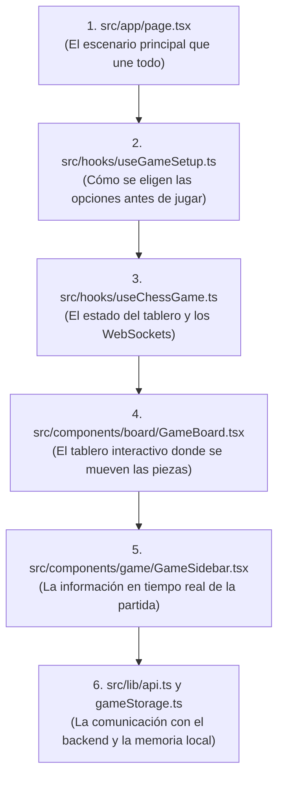
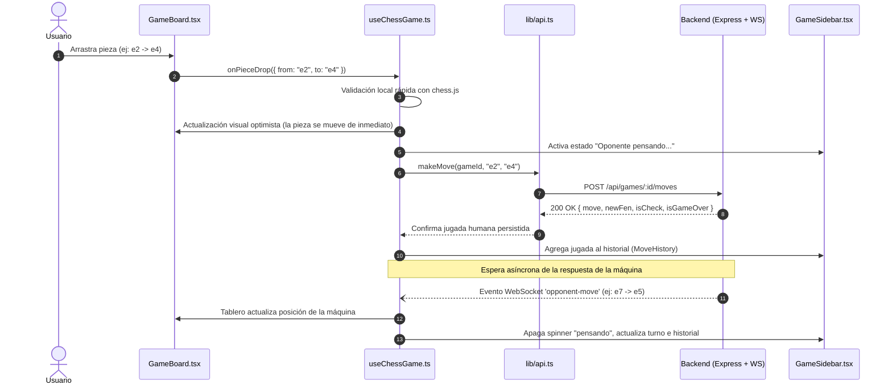

# EXPLICACION.md — Guía de Comprensión del Frontend de Ajedrito

Esta guía está diseñada para que cualquier desarrollador —desde estudiantes que recién se inician en el desarrollo web moderno hasta programadores experimentados— pueda entender cómo funciona la interfaz de usuario de Ajedrito, cómo está organizada y cómo interactúa con el usuario y con los servidores.

---

## 1. ¿Qué es el Frontend de Ajedrito y qué problema resuelve?

El frontend es la cara visible de Ajedrito: la aplicación web interactiva que corre en el navegador del usuario (computadora, tablet o teléfono móvil).

En una aplicación educativa de ajedrez, la experiencia de usuario debe superar varios desafíos clave:
1. **Cero Fricción para Estudiantes:** No debe exigir registro, contraseñas ni inicios de sesión complejos. Cualquier estudiante o aficionado debe poder entrar y comenzar a jugar en dos clics.
2. **Interactividad Fluida e Instantánea:** Mover una pieza de ajedrez debe sentirse tan natural como mover una pieza de madera real. Si el usuario tuviera que esperar a que una petición viaje a internet para ver su pieza moverse, el juego se sentiría lento y tosco.
3. **Resiliencia y Persistencia:** Si el usuario cierra el navegador o recarga la página por accidente, el sistema debe recordar la partida en curso y permitir retomarla exactamente donde quedó.
4. **Diseño Institucional y Responsivo:** La pantalla debe verse limpia, elegante y adaptarse automáticamente tanto a monitores de escritorio como a pantallas táctiles de celulares, destacando la identidad institucional de la **Universidad Nacional de Villa Mercedes (UNVIME)**.

---

## 2. Mapa del Territorio: ¿Cómo está organizada la carpeta `frontend/`?

El frontend está construido con **Next.js 16** (utilizando el moderno *App Router*), **React 19** y estilos utilitarios con **Tailwind CSS v4**:

```text
frontend/
├── public/                    # Archivos estáticos públicos (logos, favicon, imágenes)
│   ├── logo.png               # Isotipo y logotipo oficial de Ajedrito
│   └── logo_unvime.png        # Escudo institucional de la UNVIME
├── src/
│   ├── app/                   # Enrutamiento de Next.js (App Router)
│   │   ├── layout.tsx         # Envoltorio HTML raíz, metadatos y fuentes
│   │   ├── globals.css        # Estilos globales y tokens de diseño
│   │   ├── page.tsx           # Página principal: Menú, Configuración y Partida en vivo
│   │   └── game/
│   │       └── [id]/
│   │           └── page.tsx   # Ruta directa a una partida específica (/game/uuid)
│   ├── components/            # Componentes visuales organizados por dominio
│   │   ├── AjedritoHeader.tsx # Cabecera institucional con logos oficiales
│   │   ├── DecorativeFooter.tsx # Pie de página institucional y decorativo
│   │   ├── PromotionModal.tsx # Modal emergente para coronar peones (Dama, Torre, etc.)
│   │   ├── GameResultModal.tsx# Modal de fin de partida (confeti, resultado, revancha)
│   │   ├── board/
│   │   │   └── GameBoard.tsx  # Contenedor del tablero interactivo (react-chessboard)
│   │   ├── game/
│   │   │   ├── GameSidebar.tsx   # Panel lateral: turno actual, jaque, oponente pensando
│   │   │   ├── MoveHistory.tsx   # Lista con scroll automático de las jugadas en notación SAN
│   │   │   └── SavedGamesBanner.tsx # Banner para reanudar partidas no concluidas
│   │   └── setup/
│   │       ├── ModeSelector.tsx   # Paso 1: Selección de modalidad (PVP, Stockfish, IA)
│   │       └── GameConfigStep.tsx # Paso 2: Selección de dificultad, bando y botón jugar
│   ├── hooks/                 # Custom Hooks: El cerebro de la lógica de presentación
│   │   ├── useChessGame.ts    # Lógica de juego, chess.js local y conexión Socket.io
│   │   └── useGameSetup.ts    # Gestión del menú, selección de modo y localStorage
│   ├── lib/                   # Capa de infraestructura y servicios auxiliares
│   │   ├── api.ts             # Cliente HTTP (fetch) hacia los endpoints del backend
│   │   └── gameStorage.ts     # Manejador de persistencia local en localStorage
│   └── constants/
│       └── chess.ts           # FEN inicial, colores del tablero y etiquetas de resultados
```

---

## 3. ¿Por dónde empezar a leer el código? (Ruta pedagógica sugerida)

Para entender cómo se ensambla la aplicación, te recomendamos este recorrido:



1. **[`src/app/page.tsx`](file:///c:/Users/teixi/Workspace/ProyectosEducativos/Ajedrito/frontend/src/app/page.tsx):** Es el punto de encuentro. Observa cómo maneja dos grandes estados: si no hay partida activa (`!activeGameId`), muestra el asistente de configuración ([`ModeSelector`](file:///c:/Users/teixi/Workspace/ProyectosEducativos/Ajedrito/frontend/src/components/setup/ModeSelector.tsx) y [`GameConfigStep`](file:///c:/Users/teixi/Workspace/ProyectosEducativos/Ajedrito/frontend/src/components/setup/GameConfigStep.tsx)); si la partida comenzó, despliega el tablero ([`GameBoard`](file:///c:/Users/teixi/Workspace/ProyectosEducativos/Ajedrito/frontend/src/components/board/GameBoard.tsx)) y la barra lateral ([`GameSidebar`](file:///c:/Users/teixi/Workspace/ProyectosEducativos/Ajedrito/frontend/src/components/game/GameSidebar.tsx)).
2. **[`src/hooks/useChessGame.ts`](file:///c:/Users/teixi/Workspace/ProyectosEducativos/Ajedrito/frontend/src/hooks/useChessGame.ts):** Aquí reside toda la interacción ajedrecística del usuario. Mira cómo maneja el arrastre de piezas, cómo detecta la coronación de un peón y cómo escucha en segundo plano los mensajes que llegan del backend por WebSockets.
3. **[`src/components/board/GameBoard.tsx`](file:///c:/Users/teixi/Workspace/ProyectosEducativos/Ajedrito/frontend/src/components/board/GameBoard.tsx):** Observa cómo envuelve el componente `Chessboard` de la biblioteca `react-chessboard`, pasándole la posición FEN y asegurando dimensiones responsivas para que el tablero nunca se corte en pantallas pequeñas.
4. **[`src/lib/api.ts`](file:///c:/Users/teixi/Workspace/ProyectosEducativos/Ajedrito/frontend/src/lib/api.ts):** Contiene todas las funciones de red (`createGame`, `makeMove`, `getGame`). Toda llamada HTTP al servidor pasa por aquí, evitando URLs escritas a mano dentro de los componentes visuales.

---

## 4. Conceptos Clave de Arquitectura Frontend

### A. Custom Hooks: Separar la Lógica de la Vista
En React, un error común de los principiantes es mezclar llamadas a la API, efectos de WebSockets y cálculos de ajedrez dentro del mismo archivo visual que dibuja los botones. 

Ajedrito aplica el **patrón Custom Hook**:
* **[`useGameSetup`](file:///c:/Users/teixi/Workspace/ProyectosEducativos/Ajedrito/frontend/src/hooks/useGameSetup.ts):** Solo se encarga del menú inicial, cargar los perfiles de Stockfish desde la API y leer las partidas pendientes de `localStorage`.
* **[`useChessGame`](file:///c:/Users/teixi/Workspace/ProyectosEducativos/Ajedrito/frontend/src/hooks/useChessGame.ts):** Solo se encarga de la partida activa: turno actual, historial de jugadas, jaque, modales y suscripción a Socket.io.
* **Componentes Visuales (`page.tsx`, `GameBoard.tsx`):** Solo se preocupan por pintar la interfaz y responder a clics del usuario.

### B. Actualización Optimista (Optimistic UI Update)
Cuando arrastras un peón en Ajedrito, la pieza se coloca en la nueva casilla de forma instantánea en tu pantalla. El frontend no espera a que el servidor responda por internet para mostrar el movimiento:
1. El hook [`useChessGame`](file:///c:/Users/teixi/Workspace/ProyectosEducativos/Ajedrito/frontend/src/hooks/useChessGame.ts) aplica el movimiento inmediatamente en una copia local de `chess.js` y actualiza el estado visual.
2. En paralelo, dispara la petición HTTP `makeMove()` hacia el backend.
3. Si la conexión a internet fallara o el backend rechazara la jugada, el hook realiza un **rollback** automático: restaura el FEN anterior y regresa la pieza a su casilla original.

### C. Persistencia Local sin Cuentas de Usuario (`localStorage`)
En entornos educativos, obligar a crear una cuenta suele hacer que muchos estudiantes abandonen. Ajedrito utiliza [`gameStorage.ts`](file:///c:/Users/teixi/Workspace/ProyectosEducativos/Ajedrito/frontend/src/lib/gameStorage.ts): cada vez que inicias una partida, su identificador único (`gameId`) se almacena en el navegador del dispositivo. Si sales o se cierra la pestaña, el [`SavedGamesBanner`](file:///c:/Users/teixi/Workspace/ProyectosEducativos/Ajedrito/frontend/src/components/game/SavedGamesBanner.tsx) detecta la partida pendiente y te permite reanudarla con un solo clic.

---

## 5. El Flujo de una Jugada en la Pantalla

A continuación se muestra el ciclo de vida completo cuando un usuario mueve una pieza en el tablero:



---

## 6. Manejo Especial: Coronación de Peón (Promotion)

Cuando un peón llega al extremo opuesto del tablero (fila 8 para blancas o fila 1 para negras), el reglamento exige transformarlo en otra pieza (Dama, Torre, Alfil o Caballo).

1. En [`useChessGame.ts:L135`](file:///c:/Users/teixi/Workspace/ProyectosEducativos/Ajedrito/frontend/src/hooks/useChessGame.ts#L135), el método `onPieceDrop` detecta que el peón llegó a la última fila.
2. En lugar de mover de inmediato, **congela la jugada** y guarda un estado temporal (`pendingPromotion`).
3. La interfaz abre el modal emergente [`PromotionModal.tsx`](file:///c:/Users/teixi/Workspace/ProyectosEducativos/Ajedrito/frontend/src/components/PromotionModal.tsx), mostrando las cuatro piezas disponibles con símbolos grandes y claros.
4. Cuando el usuario hace clic en la pieza deseada, se completa la jugada enviando la letra de la pieza elegida (`q`, `r`, `b` o `n`) al backend.

---

## 7. ¿Dónde mirar si necesitas hacer modificaciones?

* **Si quieres cambiar los colores de las casillas del tablero:**  
  👉 Edita [`src/constants/chess.ts`](file:///c:/Users/teixi/Workspace/ProyectosEducativos/Ajedrito/frontend/src/constants/chess.ts) en el objeto `BOARD_THEME`.
* **Si quieres modificar los textos o tarjetas de los modos de juego:**  
  👉 Edita [`src/components/setup/ModeSelector.tsx`](file:///c:/Users/teixi/Workspace/ProyectosEducativos/Ajedrito/frontend/src/components/setup/ModeSelector.tsx) o [`GameConfigStep.tsx`](file:///c:/Users/teixi/Workspace/ProyectosEducativos/Ajedrito/frontend/src/components/setup/GameConfigStep.tsx).
* **Si quieres cambiar el diseño o la animación del modal de victoria:**  
  👉 Edita [`src/components/GameResultModal.tsx`](file:///c:/Users/teixi/Workspace/ProyectosEducativos/Ajedrito/frontend/src/components/GameResultModal.tsx).
* **Si necesitas modificar la URL a la que se conecta el backend:**  
  👉 Edita el archivo `.env.local` (variable `NEXT_PUBLIC_BACKEND_URL`).
