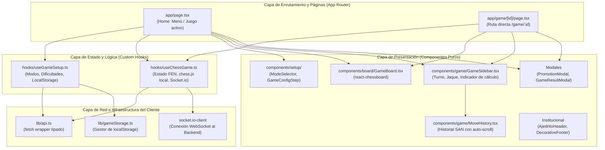

# PROYECTO.md — Documentación Técnica y de Ingeniería del Frontend

Este documento constituye la memoria técnica formal de ingeniería del **Frontend de Ajedrito**. Su objetivo es fundamentar los requisitos, la arquitectura, los componentes, el diseño de interacción y las decisiones técnicas implementadas en la interfaz de usuario, adoptando la perspectiva del ingeniero responsable de su diseño de frontend y experiencia de usuario.

---

## 1. Análisis y Requisitos

La interfaz gráfica de Ajedrito es una Single Page Application (SPA) moderna desarrollada con **Next.js 16**, orientada a ofrecer una plataforma educativa de ajedrez sin fricción de acceso y con retroalimentación inmediata.

### 1.1. Requisitos Funcionales (RF-FE)
* **RF-FE-01 (Asistente de Configuración Multimodal):** Guiar al usuario a través de un asistente de dos pasos para configurar partidas en tres modalidades (`PVP`, `PV_STOCKFISH`, `PV_AI`), permitiendo seleccionar bando (Blancas o Negras) y niveles de dificultad oficiales de Stockfish.
* **RF-FE-02 (Tablero Virtual Drag & Drop):** Proveer un tablero de ajedrez gráfico interactivo que permita arrastrar y soltar piezas con validación visual instantánea de casillas válidas.
* **RF-FE-03 (Orientación Dinámica del Tablero):** Configurar automáticamente la perspectiva del tablero (blancas abajo o negras abajo) según la elección del bando humano en partidas contra motores o según el bando del jugador 1 en PVP.
* **RF-FE-04 (Interacción de Coronación de Peón):** Interceptar el avance de un peón a la octava fila (o primera fila en negras) y desplegar un modal modalmente suspendido (`PromotionModal`) que permita elegir entre Dama, Torre, Alfil o Caballo antes de emitir la jugada.
* **RF-FE-05 (Sincronización en Tiempo Real vía WebSockets):** Suscribirse a la sala de juego en Socket.io (`join-game`) para recibir y renderizar de inmediato la jugada calculada por el oponente (`opponent-move`) y reflejar el estado de "pensando".
* **RF-FE-06 (Persistencia Local sin Autenticación):** Registrar los identificadores de partidas activas en el almacenamiento local del navegador (`localStorage`), habilitando un banner de reanudación automática de partidas no finalizadas.
* **RF-FE-07 (Evaluación y Celebración de Resultado):** Mostrar al concluir la partida un modal detallado (`GameResultModal`) con el veredicto (Victoria, Derrota o Tablas), conteo de jugadas, animación de confeti en victorias y botón de revancha rápida.

### 1.2. Requisitos No Funcionales (RNF-FE)
* **RNF-FE-01 (Interactividad Inmediata - Latencia Cero en Arrastre):** La respuesta táctil o de cursor al mover una pieza debe ser imperceptible (< 16 ms, manteniendo 60 FPS), implementando actualizaciones optimistas en la interfaz.
* **RNF-FE-02 (Diseño Responsivo y Ergonomía Visual):** La interfaz debe ajustarse armónicamente a pantallas desde 360 px de ancho hasta monitores 4K. El tablero y el panel lateral deben cohabitar sin requerir scroll vertical continuo en la vista de juego activa.
* **RNF-FE-03 (Identidad Visual Institucional):** Integrar la identidad gráfica de la **Universidad Nacional de Villa Mercedes (UNVIME)** y de Ajedrito mediante una paleta cromática equilibrada (tonos verdes bosque `#233E31`, crema claro `#F6F5F0` y acabados de precisión).
* **RNF-FE-04 (Resiliencia ante Caídas de Red):** Si una llamada HTTP de movimiento falla, el frontend debe realizar un rollback visual de la pieza a su casilla de origen sin corromper el estado del juego.

---

## 2. Arquitectura del Frontend

El frontend implementa una **Arquitectura Dirigida por Componentes (Component-Driven Architecture)** sobre Next.js 16 (App Router), con una estricta separación de responsabilidades:



### Principio de Separación de Capas:
1. **Componentes Visuales Libres de Lógica de Red:** Componentes como `GameBoard` o `GameConfigStep` son puramente receptivos (reciben datos vía `props` y emiten eventos vía callbacks), lo que maximiza su reutilización y testabilidad visual.
2. **Lógica Centralizada en Hooks:** Los estados complejos (WebSockets, rollback optimista, gestión de tiempos) están confinados en `useChessGame` y `useGameSetup`.
3. **Punto Único de Acceso a la Red:** `lib/api.ts` centraliza las URLs y encabezados HTTP.

---

## 3. Diseño Técnico y Manejo de Estado

### 3.1. Doble Verificación de Reglas (Cliente Optimista + Autoridad Backend)
* **En el Cliente:** El hook [`useChessGame.ts`](file:///c:/Users/teixi/Workspace/ProyectosEducativos/Ajedrito/frontend/src/hooks/useChessGame.ts) mantiene una referencia mutable de `Chess` (`chessRef.current`). Cuando el usuario suelta una pieza, `chess.js` valida instantáneamente si el movimiento es legal para ese bando. Si lo es, actualiza el estado `fen` en React inmediatamente.
* **En el Servidor:** El servidor de Node.js revalida la jugada con su propia instancia de `chess.js` y la persiste.
* **Mecanismo de Rollback:** Si la promesa de `makeMove()` es rechazada (por fallo de red o rechazo del servidor), el bloque `.catch()` de `useChessGame` ejecuta:
  ```typescript
  chess.load(prevFen);
  setFen(prevFen);
  setIsCheck(chess.isCheck());
  setIsOpponentThinking(false);
  ```
  Esto devuelve la pieza a su posición anterior sin inconsistencias.

### 3.2. Ciclo de Vida del WebSocket (Socket.io Client)
La conexión en tiempo real está vinculada al ciclo de vida del componente mediante `useEffect` en [`useChessGame.ts`](file:///c:/Users/teixi/Workspace/ProyectosEducativos/Ajedrito/frontend/src/hooks/useChessGame.ts#L181):
1. **Conexión y Sala:** Al detectarse un `gameId` válido, se conecta con `io(BACKEND_URL)` y emite `socket.emit('join-game', gameId)`.
2. **Suscripción de Eventos:** Escucha `opponent-move` (para aplicar la jugada de Stockfish/IA y desactivar el estado de pensamiento) y `opponent-error` (para alertar fallos del motor rival).
3. **Limpieza Rigurosa (Teardown):** La función de limpieza del efecto ejecuta `socket.disconnect()`, garantizando que al cambiar de pantalla o abandonar la partida no se mantengan listeners fantasma ni conexiones zombi en el servidor.

### 3.3. Manejo Suspendido de la Coronación de Peón
En [`useChessGame.ts:L135-157`](file:///c:/Users/teixi/Workspace/ProyectosEducativos/Ajedrito/frontend/src/hooks/useChessGame.ts#L135-L157):
* Si una jugada involucra un peón que llega a la última fila, `onPieceDrop` retorna `false` (impidiendo la ejecución automática del movimiento tradicional) y puebla el estado `pendingPromotion = { sourceSquare, targetSquare, color }`.
* La presencia de `pendingPromotion` activa condicionalmente [`PromotionModal.tsx`](file:///c:/Users/teixi/Workspace/ProyectosEducativos/Ajedrito/frontend/src/components/PromotionModal.tsx).
* Al hacer clic en la pieza deseada, `handleSelectPromotion` dispara `executeMove(source, target, piece)` y limpia el estado pendiente.

### 3.4. Dimensionamiento Responsivo sin Scroll Forzado
Un defecto común en tableros web de ajedrez es que en computadoras portátiles o tablets el tablero empuja la barra lateral fuera de la pantalla, obligando al usuario a hacer scroll para ver qué jugó el rival.

En [`GameBoard.tsx:L27-31`](file:///c:/Users/teixi/Workspace/ProyectosEducativos/Ajedrito/frontend/src/components/board/GameBoard.tsx#L27-L31), el contenedor utiliza la regla de contención matemática de CSS:
```css
w-[min(480px,calc(100vw-3.5rem),55vh)] aspect-square
```
* **Comportamiento:** En celulares ocupa el ancho casi total de la pantalla (`100vw - 3.5rem`); en pantallas verticales de laptops o monitores chicos se auto-limita al 55% de la altura visible del viewport (`55vh`); y en monitores grandes no excede los `480px`. Esto asegura que el tablero, el panel de control y el historial permanezcan 100% visibles simultáneamente.

---

## 4. Modelado y Gestión de Datos del Frontend

### 4.1. Definición de Tipos TypeScript ([`src/lib/api.ts`](file:///c:/Users/teixi/Workspace/ProyectosEducativos/Ajedrito/frontend/src/lib/api.ts))
* **`GameMode`:** `'PVP' | 'PV_STOCKFISH' | 'PV_AI'`.
* **`DifficultyProfile`:** `{ id, name, engineType, skillLevel, searchDepth, timeLimitMs }`.
* **`MoveRecord`:** Registro inmutable de jugada persistida `{ id, moveNumber, color, san, fenBefore, fenAfter, timeSpentMs, createdAt }`.
* **`GameStateResponse`:** Estado agregado de partida `{ game: GameRecord, moves: MoveRecord[] }`.

### 4.2. Persistencia en el Navegador ([`src/lib/gameStorage.ts`](file:///c:/Users/teixi/Workspace/ProyectosEducativos/Ajedrito/frontend/src/lib/gameStorage.ts))
* Gestiona la clave `'ajedrito_local_games'` en `localStorage`.
* Mantiene una cola FIFO circular acotada a las 20 partidas más recientes (`.slice(0, 20)`), evitando que el almacenamiento local crezca indefinidamente.

---

## 5. Reglas de Negocio en la Interfaz

1. **Restricción de Arrastre (`isDraggable`):**
   * Una pieza solo puede ser arrastrada si:
     * La partida no ha concluido (`!isGameOver`).
     * El oponente sintético no se encuentra calculando (`!isOpponentThinking`).
     * El turno actual del tablero coincide con el color asignado al usuario humano (`humanColor === null || currentTurn === humanColor`).
2. **Bloqueo del Botón de Inicio:**
   * El botón "Comenzar partida" en [`GameConfigStep.tsx`](file:///c:/Users/teixi/Workspace/ProyectosEducativos/Ajedrito/frontend/src/components/setup/GameConfigStep.tsx) permanece inhabilitado hasta que se haya seleccionado un modo, un bando, y (en modo Stockfish) un perfil de dificultad válido.

---

## 6. Componentes y Responsabilidades (Matriz SRP)

| Componente | Responsabilidad Única (SRP) | Dependencias Clave |
| :--- | :--- | :--- |
| [`app/page.tsx`](file:///c:/Users/teixi/Workspace/ProyectosEducativos/Ajedrito/frontend/src/app/page.tsx) | Orquestador principal de la vista de inicio, montaje de pasos de configuración y tablero en vivo. | `useGameSetup`, `useChessGame`, componentes UI |
| [`app/game/[id]/page.tsx`](file:///c:/Users/teixi/Workspace/ProyectosEducativos/Ajedrito/frontend/src/app/game/%5Bid%5D/page.tsx) | Carga y sincronización de partidas directamente mediante URL con parámetro dinámico. | `useChessGame`, `api.ts`, `gameStorage.ts` |
| [`hooks/useChessGame.ts`](file:///c:/Users/teixi/Workspace/ProyectosEducativos/Ajedrito/frontend/src/hooks/useChessGame.ts) | Máquina de estados de la partida, arbitraje local con `chess.js`, optimismo visual y WebSocket. | `chess.js`, `socket.io-client`, `api.ts` |
| [`hooks/useGameSetup.ts`](file:///c:/Users/teixi/Workspace/ProyectosEducativos/Ajedrito/frontend/src/hooks/useGameSetup.ts) | Gestión del estado del asistente de juego, carga de perfiles y lectura de partidas guardadas. | `api.ts`, `gameStorage.ts` |
| [`components/board/GameBoard.tsx`](file:///c:/Users/teixi/Workspace/ProyectosEducativos/Ajedrito/frontend/src/components/board/GameBoard.tsx) | Renderizado visual del tablero de ajedrez, captura de drops y dimensiones responsivas. | `react-chessboard`, `BOARD_THEME` |
| [`components/game/GameSidebar.tsx`](file:///c:/Users/teixi/Workspace/ProyectosEducativos/Ajedrito/frontend/src/components/game/GameSidebar.tsx) | Visualización del estado del turno, indicador de jaque, loader de cálculo e historial. | `MoveHistory.tsx`, `lucide-react` |
| [`components/game/MoveHistory.tsx`](file:///c:/Users/teixi/Workspace/ProyectosEducativos/Ajedrito/frontend/src/components/game/MoveHistory.tsx) | Renderizado en dos columnas (blancas/negras) de la notación SAN con auto-scroll al fondo. | React `useRef`, `MoveRecord` |
| [`components/setup/ModeSelector.tsx`](file:///c:/Users/teixi/Workspace/ProyectosEducativos/Ajedrito/frontend/src/components/setup/ModeSelector.tsx) | Selector interactivo de tarjetas de los tres modos de juego. | `lucide-react` |
| [`components/setup/GameConfigStep.tsx`](file:///c:/Users/teixi/Workspace/ProyectosEducativos/Ajedrito/frontend/src/components/setup/GameConfigStep.tsx) | Configuración de nivel de dificultad Elo y selección de color de piezas. | `DifficultyProfile`, `lucide-react` |
| [`components/PromotionModal.tsx`](file:///c:/Users/teixi/Workspace/ProyectosEducativos/Ajedrito/frontend/src/components/PromotionModal.tsx) | Diálogo modal para la elección de pieza de coronación. | React Portal / Fixed Overlay |
| [`components/GameResultModal.tsx`](file:///c:/Users/teixi/Workspace/ProyectosEducativos/Ajedrito/frontend/src/components/GameResultModal.tsx) | Celebración de fin de partida, confeti (`canvas-confetti`), estadísticas y revancha. | `canvas-confetti`, `lucide-react` |

---

## 7. Patrones de Diseño Implementados

1. **Custom Hook Pattern ([`useChessGame`](file:///c:/Users/teixi/Workspace/ProyectosEducativos/Ajedrito/frontend/src/hooks/useChessGame.ts), [`useGameSetup`](file:///c:/Users/teixi/Workspace/ProyectosEducativos/Ajedrito/frontend/src/hooks/useGameSetup.ts)):**
   * *Problema:* Desacoplar la gestión de red y estado de ajedrez de los componentes de renderizado de React.
   * *Solución:* Encapsula el ciclo de vida de `chess.js`, las promesas HTTP y los listeners de Socket.io en hooks reutilizables.
2. **Optimistic UI Pattern (Actualización Optimista):**
   * *Problema:* El retardo de ida y vuelta de red (RTT) crea una experiencia de juego lenta e incómoda.
   * *Solución:* Se actualiza la UI de inmediato y se despacha la llamada HTTP en background, aplicando rollback si el servidor rechaza el movimiento.
3. **Controlled Component & Presentation Pattern:**
   * *Problema:* Evitar que los componentes secundarios manejen estados globales desincronizados.
   * *Solución:* Componentes como `GameBoard` y `GameSidebar` son controlados y puramente dependientes de las propiedades enviadas por la página contenedora.

---

## 8. Decisiones Técnicas y Justificaciones Profesionales

* **¿Por qué Next.js 16 (App Router) y React 19?**
  * *Justificación:* Next.js proporciona una estructura de carpetas estandarizada, optimización automática de imágenes y fuentes, empaquetado rápido mediante Turbopack y un ecosistema TypeScript robusto para aplicaciones educativas de producción.
* **¿Por qué `react-chessboard` en lugar de programar un tablero desde cero?**
  * *Justificación:* Gestionar manualmente el drag-and-drop con soporte para eventos táctiles móviles (touch events), animaciones de movimiento suaves y cálculo de coordenadas de 64 casillas requiere cientos de líneas de código propenso a errores. `react-chessboard` es la solución estándar de la industria, altamente testeada y compatible con `chess.js`.
* **¿Por qué `localStorage` en lugar de autenticación con usuarios y contraseñas?**
  * *Justificación:* En un entorno educativo de escuela o universidad, exigir un login reduce drásticamente la tasa de uso. Permitir que cualquier alumno juegue instantáneamente y guarde hasta 20 partidas en su propio navegador ofrece la máxima comodidad con costo de infraestructura cero.

---

## 9. Restricciones y Consideraciones de Mantenimiento

1. **Conexión con el Backend:** Requiere que la variable de entorno `NEXT_PUBLIC_BACKEND_URL` apunte al servidor Node.js en ejecución (por defecto `http://localhost:3001`).
2. **Oportunidades de Refactorización Detectadas en Auditoría:**
   * Sustituir los diálogos nativos `alert(...)` por un sistema de notificaciones/toasts moderno no bloqueante.
   * Unificar el marcado duplicado entre [`page.tsx`](file:///c:/Users/teixi/Workspace/ProyectosEducativos/Ajedrito/frontend/src/app/page.tsx) y [`game/[id]/page.tsx`](file:///c:/Users/teixi/Workspace/ProyectosEducativos/Ajedrito/frontend/src/app/game/%5Bid%5D/page.tsx) extrayendo la vista activa a un componente compartido (`GameView`).
